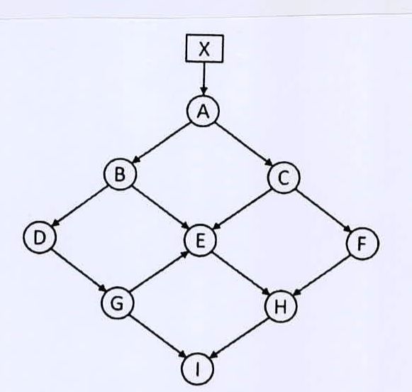

Consider the network of objects in the figure below. Assume, $X$ denotes the *root set*. Suppose at some point in time, the pointer $A \to C$ is deleted. Then we execute Cheney's copying garbage collection algorithm on the network. Also, suppose that,

(i) Each object has size 100 bytes,

(ii) The unscanned list is managed as a queue, and when an object has more than one pointer, the reached objects are added to the queue in alphabetical order,

(iii) The *From* semispace starts at location 0, and the *To* semispace starts at location 10,000, and

(iv) Initially, all the objects in the heap are arranged in alphabetical order starting at byte 0.

What is the value of *NewLoction(o)* for each object *o* that remains after garbage collection? Draw the heaps before and after running garbage collection, showing- (i) locations of the allocated objects, (ii) references running among the objects. What is the time complexity of the algorithm?

