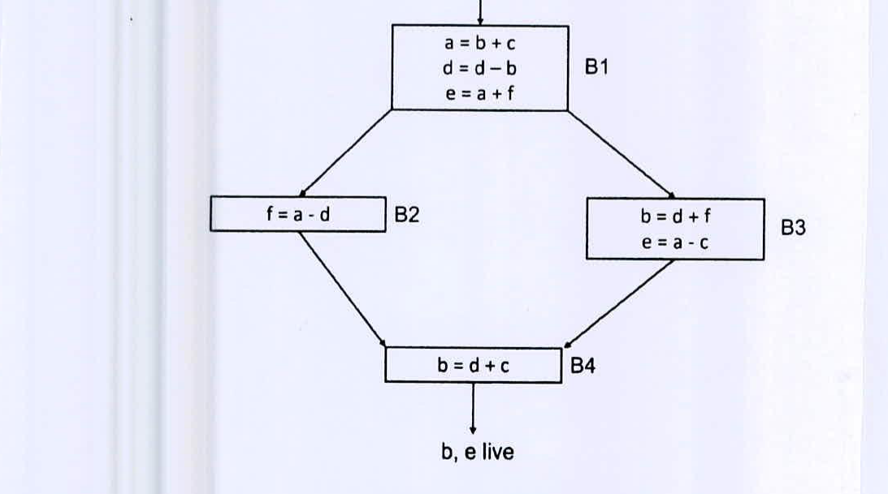

Given the flow graph of a program, formulate the problem of global register allocation as a graph coloring problem. Show detailed formulation steps using the flow graph in the figure below as an example. Subsequently, find a register allocation for the given program using *Chaitin's* algorithm. Assume that three physical registers are available. Illustrate all steps of the algorithm.



*Figure for Question 8(b), as drawn:*

```text
B1: a = b + c          B1 -> B2, B1 -> B3
    d = d - b
    e = a + f
B2: f = a - d          B2 -> B4
B3: b = d + f          B3 -> B4
    e = a - c
B4: b = d + c          (b, e live on exit)
```
