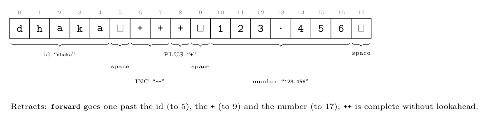

Positions in the buffer:

```text
position: 0 1 2 3 4 5 6 7 8 9 10 11 12 13 14 15 16 17
char:     d h a k a _ + + + _ 1  2  3  .  4  5  6  _
```



`lexemeBegin` (lB) marks the start of the current lexeme, and `forward` (f) scans ahead. When a token is found, f is set to its last character (retracting if it went one too far), the token is returned, and lB = f = the next character. C uses the **longest match**.

1. **Identifier.** lB = f = 0. f moves over `d h a k a` and reaches the blank at 5, which cannot continue an identifier. **Retract** f to 4. Return `<id, pointer to dhaka>`. Set lB = f = 5.
2. **White space.** The blank at 5 is read; f reaches `+` at 6, so retract. White space is skipped and no token is returned. lB = f = 6.
3. **`++`.** At 6, `+` may begin `+`, `++` or `+=`, so f advances to 7. It is `+`, and `++` is complete: C has no longer token starting with `++`, so no extra lookahead is needed. Return `<INC>` (`++`). lB = f = 8.
4. **`+`.** At 8, `+`; f advances to 9 and finds a blank, which is neither `+` nor `=`. **Retract** f to 8 and return `<PLUS>` (`+`). This is the maximal munch: `+++` is split as `++` `+`. lB = f = 9.
5. **White space** at 9 is skipped (f reads `1` at 10 and retracts). lB = f = 10.
6. **Number.** f moves over `1 2 3 . 4 5 6` and reaches the blank at 17. It could still have been an exponent (`E`), but a blank ends the number, so retract f to 16. Return `<number, 123.456>`. lB = f = 17.
7. **White space** at 17 is skipped.

| Step | lexemeBegin | forward (furthest / final) | Token |
|:-:|:-:|:-:|:--|
| 1 | 0 | 5 / 4 | id `dhaka` |
| 2 | 5 | 6 / 5 | (white space) |
| 3 | 6 | 7 / 7 | `++` |
| 4 | 8 | 9 / 8 | `+` |
| 5 | 9 | 10 / 9 | (white space) |
| 6 | 10 | 17 / 16 | number `123.456` |
| 7 | 17 | 18 / 17 | (white space) |

Token stream given to the parser: **id, `++`, `+`, number**. If `forward` reaches the end of a buffer half (sentinel `eof`) during a step, the other half is reloaded and scanning continues.
