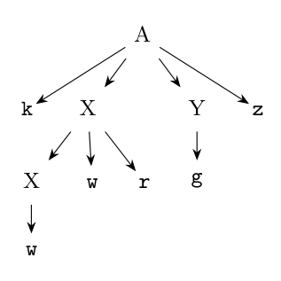

**Parse tree for `kwwrgz`:**

**Rightmost derivation:**

$$A \underset{rm}{\Rightarrow} kXYz \underset{rm}{\Rightarrow} kXgz \underset{rm}{\Rightarrow} kXwrgz \underset{rm}{\Rightarrow} kwwrgz$$

**Handles** (the right-sentential forms read backwards, i.e. handle pruning):

| Right-sentential form | Handle | Reduce by |
|:--|:--|:--|
| k w w r g z | the first w (position 2) | $X \to w$ |
| k X w r g z | X w r (positions 2-4) | $X \to Xwr$ |
| k X g z | g | $Y \to g$ |
| k X Y z | k X Y z | $A \to kXYz$ |
| A | | (start symbol: done) |

Note: the second `w` in `kwwrgz` is **not** a handle even though it matches $X \to w$. Reducing it would give `kwXrgz`, which is not a right-sentential form, so the parse would fail. The handle is the first `w`.
