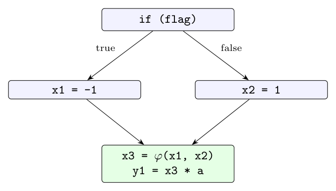

**Two distinctive aspects of SSA (8 marks).**

1. **Every assignment is to a distinct name.** In ordinary three-address code a variable may be assigned many times. In SSA each definition creates a new version, so every name is defined exactly once in the program text.

| Three-address code | SSA form |
|:--|:--|
| `p = a + b` | `p1 = a + b` |
| `q = p - c` | `q1 = p1 - c` |
| `p = q * d` | `p2 = q1 * d` |
| `p = e - p` | `p3 = e - p2` |
| `q = p + q` | `q2 = p3 + q1` |

2. **$\varphi$-functions at join points.** If a variable is defined differently on two control-flow paths that meet, SSA combines the versions with a $\varphi$-function, which selects the value according to the path taken:

```text
if (flag) x1 = -1; else x2 = 1;
x3 = phi(x1, x2);
y1 = x3 * a;
```



**How SSA facilitates optimisation (5 marks).** Because each name has a single definition, **every use has exactly one reaching definition**. The definition-use relation is visible directly in the names, without iterative reaching-definitions analysis. Many optimisations become simple and fast:

- **Constant propagation:** if `x1 = 4`, every use of `x1` can be replaced by 4. No later assignment can change `x1`.
- **Copy propagation:** after `y2 = x1`, replace `y2` by `x1` everywhere.
- **Dead-code elimination:** a definition whose name has no uses is dead and can be deleted (repeat until no change).
- **Common-subexpression / redundancy elimination:** `t1 = a1 + b1` and `t5 = a1 + b1` certainly compute the same value, since `a1` and `b1` cannot change in between.

**Example:**

```text
x1 = 4
y1 = x1 + 2        ->  y1 = 6     (constant propagation and folding)
x2 = y1 * 3        ->  x2 = 18
z1 = x1 + 1        ->  z1 = 5     (x1 is still 4: no other x1 definition)
```

In ordinary code, `x` is redefined between the uses, so the compiler would need data-flow analysis to know which `x` each use refers to. In SSA, the answer is in the name.
