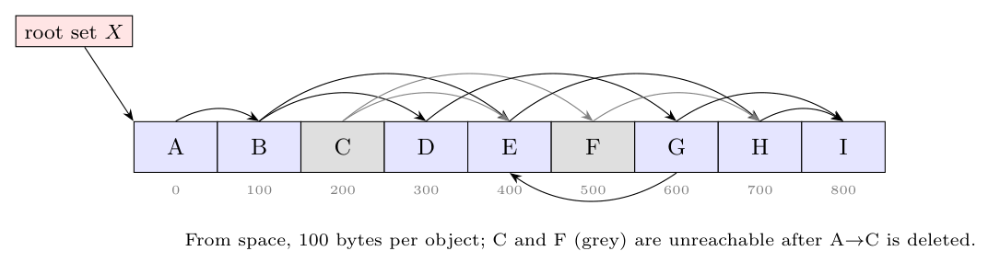
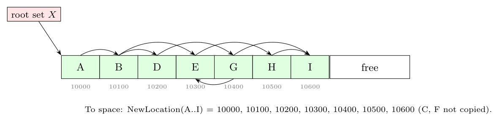

**Assumptions.** The edges are read from the figure: X $\to$ A, A $\to$ B, A $\to$ C (deleted), B $\to$ D, B $\to$ E, C $\to$ E, C $\to$ F, D $\to$ G, G $\to$ E, E $\to$ H, F $\to$ H, G $\to$ I, H $\to$ I. $X$ is the root set and points only to A. Objects are 100 bytes each, as stated.

**Reachability after deleting A $\to$ C.** From X: A $\to$ B $\to$ {D, E}; D $\to$ G $\to$ {E, I}; E $\to$ H $\to$ I. So **A, B, D, E, G, H, I** are reachable. **C** has no other incoming pointer, and **F** is reachable only from C, so both are garbage.

**Heap before GC (From space):**

**Cheney's algorithm.** `free` and `unscanned` start at 10000. `LookupNewLocation(o)` copies `o` to `free` the first time it is reached; the region between `unscanned` and `free` is the queue.

| Step | Action | Copied to | `free` after |
|:-:|:--|:--|:-:|
| 1 | root X $\to$ A: copy A | A = 10000 | 10100 |
| 2 | scan A (10000): B not copied, so copy it | B = 10100 | 10200 |
| 3 | scan B: D, E (alphabetical) | D = 10200, E = 10300 | 10400 |
| 4 | scan D: G | G = 10400 | 10500 |
| 5 | scan E: H | H = 10500 | 10600 |
| 6 | scan G: E (already copied, pointer set to 10300), I | I = 10600 | 10700 |
| 7 | scan H: I already copied (pointer set to 10600) | | 10700 |
| 8 | scan I: no pointers; `unscanned` = `free`, so stop | | 10700 |

**NewLocation(o):**

| Object | A | B | C | D | E | F | G | H | I |
|:--|:-:|:-:|:-:|:-:|:-:|:-:|:-:|:-:|:-:|
| NewLocation | 10000 | 10100 | NULL | 10200 | 10300 | NULL | 10400 | 10500 | 10600 |

**Heap after GC (To space):** all pointers are redirected to the new addresses.

C and F are never copied. The whole From space (0-899) becomes free, and the roles of the two semispaces swap for the next collection.

**Time complexity.** Each reachable object is copied once and scanned once, and each of its pointers is examined once. The work is proportional to the **total size of the reachable objects** (here 7 objects, 700 bytes), i.e. $O(\text{reachable data})$. It is independent of the amount of garbage, which is never touched.
