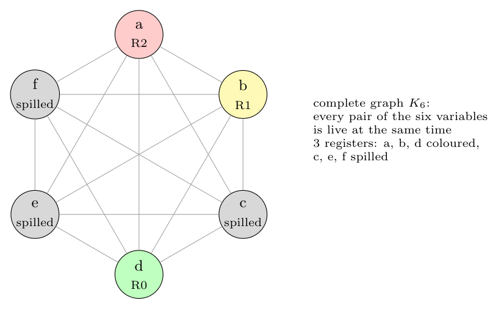

**Assumptions.**

- Only `b` and `e` are live on exit (as marked). The variables used before being defined (`b`, `c`, `d`, `f`) are live on entry, so they hold values at the same time and interfere.
- Two variables interfere if they are live at the same program point.
- When no node has fewer than 3 neighbours, the **spill candidate** is the node with the lowest spill cost (number of uses + definitions), ties alphabetical. This is one of the heuristics on KMS's "Improvements to the Algorithm" slide.

**Step 1: liveness** (backward over the flow graph; statements numbered 1-7):

| Block | Statement | Live in | Live out |
|:-:|:--|:--|:--|
| B1 | 1: `a = b + c` | b, c, d, f | a, b, c, d, f |
| B1 | 2: `d = d - b` | a, b, c, d, f | a, c, d, f |
| B1 | 3: `e = a + f` | a, c, d, f | a, c, d, e, f |
| B2 | 4: `f = a - d` | a, c, d, e | c, d, e |
| B3 | 5: `b = d + f` | a, c, d, f | a, c, d |
| B3 | 6: `e = a - c` | a, c, d | c, d, e |
| B4 | 7: `b = d + c` | c, d, e | b, e |

**Step 2: formulation as graph colouring.** Build the register interference graph (RIG): one **node per variable**, and an **edge** between two variables that are live at the same point, since they cannot share a register. Then register allocation with $k$ registers is $k$-colouring the RIG (colour = register).

From the table:

- {a, b, c, d, f} are all live together after statement 1, giving every pair among them.
- {a, c, d, e, f} are live together after statement 3, giving every pair involving e except b-e.
- {b, e} are live together at the exit.

So **every pair of the six variables interferes**: the RIG is the complete graph $K_6$.

Edges (all 15 pairs): a-b, a-c, a-d, a-e, a-f, b-c, b-d, b-e, b-f, c-d, c-e, c-f, d-e, d-f, e-f.

A $K_6$ needs 6 colours. With 3 registers, **at least 3 variables must be spilled**. (Even ignoring the entry, five variables are live at once after statements 1 and 3.)

**Step 3: Chaitin's algorithm, $k = 3$.** Spill costs (uses + defs): a 5, b 4, c 3, d 5, e 2, f 3.

| Step | Degrees | Action | Stack |
|:-:|:--|:--|:--|
| 1 | all 5 | no node with degree < 3: remove the cheapest, **e** (troublesome) | e |
| 2 | all 4 | remove **c** (cost 3; tie with f broken alphabetically), troublesome | e, c |
| 3 | all 3 | remove **f**, troublesome | e, c, f |
| 4 | a2 b2 d2 | remove **a** (degree 2 < 3) | e, c, f, a |
| 5 | b1 d1 | remove **b** | ..., b |
| 6 | d0 | remove **d** | ..., d |

Select (pop):

| Pop | Neighbours' registers | Result |
|:-:|:--|:-:|
| d | none | **R0** |
| b | d = R0 | **R1** |
| a | d = R0, b = R1 | **R2** |
| f | R0, R1, R2 all used | **spill** |
| c | R0, R1, R2 all used | **spill** |
| e | R0, R1, R2 all used | **spill** |

**Allocation:** `d` $\to$ R0, `b` $\to$ R1, `a` $\to$ R2. **`c`, `e` and `f` are spilled**: they live in memory, with a load before each use and a store after each definition.



**Handling the spills.** Rewrite the code with the spilled variables in memory, e.g. B1 becomes

```text
c1 = load c       a = b + c1
                  d = d - b
f1 = load f       e1 = a + f1
                  store e1 -> e
```

Then recompute liveness, rebuild the RIG and colour again. The new temporaries (`c1`, `f1`, `e1`) have very short live ranges, so they can use a register that is momentarily free (e.g. `b`'s register R1 while `b` is dead between statements 2 and 5).
