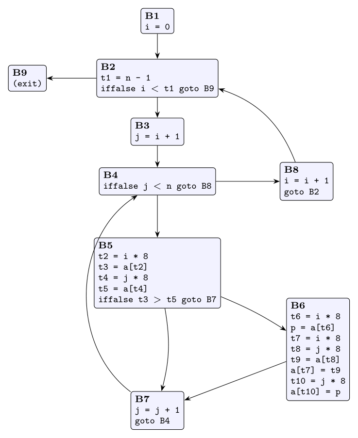
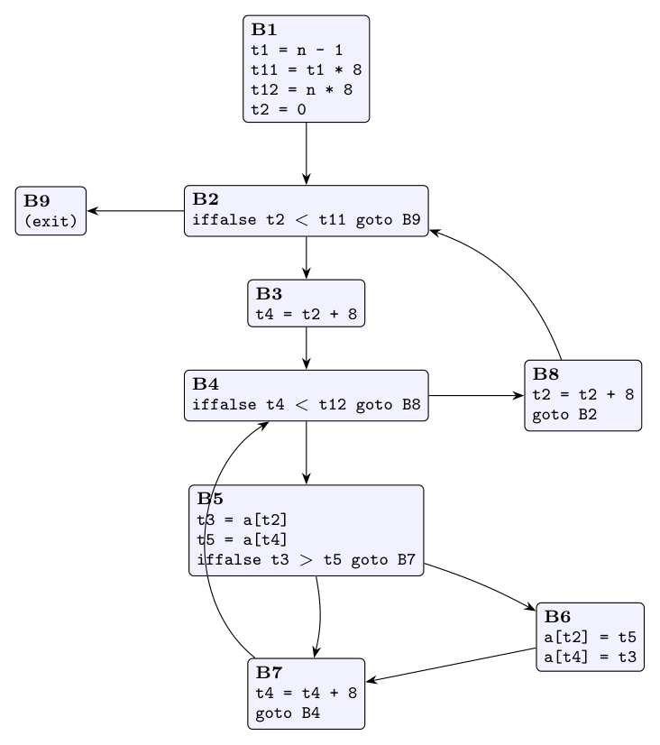

**Assumptions.** Array elements are 8 bytes (as the code's `*8` shows). `n` is not changed anywhere in the code and `a` is the only array. `8*n` does not overflow. Labels L1, L4, L7, L9, L10 and L11 are never jump targets, so they do not start blocks.

**(i) Basic blocks and flow graph (10 marks)**

Leaders (Algorithm 8.5): the first instruction (1); every jump target (L3 = 2, L5 = 5, L8 = 19, L6 = 21, L2 = 23); every instruction right after a jump (4, 6, 11, 21, 23). So the leaders are 1, 2, 4, 5, 6, 11, 19, 21, 23.

| Block | Lines | Code (labels replaced by blocks) |
|:-:|:-:|:--|
| B1 | 1 | `i = 0` |
| B2 | 2-3 | `t1 = n - 1`; `iffalse i < t1 goto B9` |
| B3 | 4 | `j = i + 1` |
| B4 | 5 | `iffalse j < n goto B8` |
| B5 | 6-10 | `t2 = i * 8`; `t3 = a[t2]`; `t4 = j * 8`; `t5 = a[t4]`; `iffalse t3 > t5 goto B7` |
| B6 | 11-18 | `t6 = i * 8`; `p = a[t6]`; `t7 = i * 8`; `t8 = j * 8`; `t9 = a[t8]`; `a[t7] = t9`; `t10 = j * 8`; `a[t10] = p` |
| B7 | 19-20 | `j = j + 1`; `goto B4` |
| B8 | 21-22 | `i = i + 1`; `goto B2` |
| B9 | 23 | (exit) |



Edges: B1 $\to$ B2; B2 $\to$ B3, B9; B3 $\to$ B4; B4 $\to$ B5, B8; B5 $\to$ B6, B7; B6 $\to$ B7; B7 $\to$ B4; B8 $\to$ B2. The inner loop is {B4, B5, B6, B7} and the outer loop is {B2, ..., B8}.

**(ii) Optimisation (15 marks)**

1. **Common-subexpression elimination.** In B6, `i` and `j` have not changed since B5, and nothing is stored into `a` between B5 and B6. So `t6 = i*8` and `t7 = i*8` equal `t2`; `t8 = j*8` and `t10 = j*8` equal `t4`; `p = a[t6]` equals `t3`; `t9 = a[t8]` equals `t5`.
2. **Copy propagation.** Using `t3` for `p` and `t5` for `t9`, B6 becomes `a[t2] = t5` and `a[t4] = t3` (a swap).
3. **Dead-code elimination.** `t6`-`t10` and `p` are no longer used, so their assignments are removed.
4. **Code motion.** `t1 = n - 1` in B2 is loop-invariant (`n` never changes). Move it to B1, the preheader of the outer loop. In the inner loop, `t2 = i*8` is invariant (`i` changes only in B8), so it can move to B3; step 5 then removes it from the inner loop altogether.
5. **Reduction in strength.**
- `j` is a basic induction variable of the inner loop (`j = j + 1` in B7), and `t4 = 8j` is a derived one. Keep `t4` updated with `t4 = t4 + 8` in B7, initialising it in B3. Since `j = i + 1`, the initial value is `t4 = t2 + 8`.
- `i` is the induction variable of the outer loop, and `t2 = 8i`. Use `t2 = t2 + 8` in B8, initialised to `t2 = 0` in B1.
6. **Induction-variable elimination.**
- The inner test `j < n` becomes `t4 < 8n`, with `t12 = n * 8` computed once in B1.
- The outer test `i < t1` becomes `t2 < 8t1`, with `t11 = t1 * 8` in B1.
- Now `i` and `j` are not used at all, so `i = 0`, `j = i + 1`, `j = j + 1` and `i = i + 1` are deleted.

**Optimised code:**

```text
B1:  t1 = n - 1
     t11 = t1 * 8
     t12 = n * 8
     t2 = 0
B2:  iffalse t2 < t11 goto B9
B3:  t4 = t2 + 8
B4:  iffalse t4 < t12 goto B8
B5:  t3 = a[t2]
     t5 = a[t4]
     iffalse t3 > t5 goto B7
B6:  a[t2] = t5
     a[t4] = t3
B7:  t4 = t4 + 8
     goto B4
B8:  t2 = t2 + 8
     goto B2
B9:
```



`t3 = a[t2]` cannot be moved out of the inner loop, because B6 stores into `a[t2]`. The inner loop shrinks from 17 instructions (B4-B7) to 9, with no multiplications.

| Transformation | Applied to |
|:--|:--|
| Common-subexpression elimination | `i*8`, `j*8`, `a[t2]`, `a[t4]` in B6 |
| Copy propagation | `p`, `t9` |
| Dead-code elimination | `t6`-`t10`, `p`, and finally `i`, `j` |
| Code motion | `t1 = n - 1`, `t11`, `t12` into B1 |
| Reduction in strength | `t2 = t2 + 8`, `t4 = t4 + 8` |
| Induction-variable elimination | tests on `i`, `j` replaced by tests on `t2`, `t4` |
