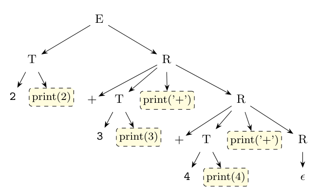

**Assumptions.** The question gives only the $E$-productions. For the output, $T$ is assumed to be $T \to \textbf{num}\ \{\text{print}(\textbf{num}.val);\}$ (a number is printed as soon as it is read).

**Transformation (5 marks).** The SDT is left recursive, so a top-down parser cannot use it. Eliminate the left recursion treating the action as if it were a terminal symbol. The rule

$$A \to A\alpha \mid \beta \quad\Longrightarrow\quad A \to \beta R, \quad R \to \alpha R \mid \epsilon$$

with $A = E$, $\alpha = +\,T\ \{\text{print}('+');\}$ and $\beta = T$ gives

$$E \to T\ R$$

$$R \to +\ T\ \{\text{print}('+');\}\ R$$

$$R \to \epsilon$$

The action stays in the same position relative to the symbols around it (after $T$), so the printing order is unchanged. The new grammar is LL(1): $R$ chooses $+$ on `+` and $\epsilon$ on FOLLOW($R$) = FOLLOW($E$).

**Correctness for 2+3+4 (4 marks).** Leftmost (top-down) parse, executing each action when it is reached:

| Step | Expansion / action | Output so far |
|:-:|:--|:--|
| 1 | $E \to T\ R$ | |
| 2 | $T \to 2\ \{\text{print}(2)\}$ | 2 |
| 3 | $R \to +\ T\ \{\text{print}('+')\}\ R$; match `+` | 2 |
| 4 | $T \to 3\ \{\text{print}(3)\}$ | 2 3 |
| 5 | action `print('+')` | 2 3 + |
| 6 | $R \to +\ T\ \{\text{print}('+')\}\ R$; match `+` | 2 3 + |
| 7 | $T \to 4\ \{\text{print}(4)\}$ | 2 3 + 4 |
| 8 | action `print('+')` | 2 3 + 4 + |
| 9 | $R \to \epsilon$ (input at end) | 2 3 + 4 + |

Output **`2 3 + 4 +`**, the postfix form of $(2+3)+4$: `+` is left-associative, as in the original SDT.
