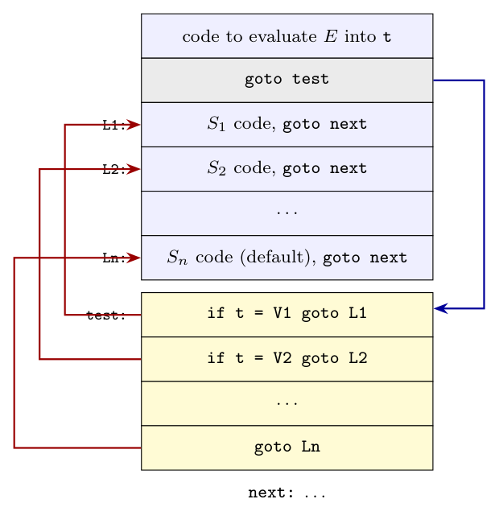

**Outline of the syntax-directed translation (10 marks).**

1. Evaluate the expression $E$ into a temporary `t`.
2. Jump to the test section (`goto test`), which is generated **at the end**, after all case bodies. Its values and labels are only known once the whole statement has been parsed.
3. For each `case Vi: Si`, create a new label `Li`, emit `Li:`, the code for `Si`, and `goto next` (no `break` modelled). Record the pair `(Vi, Li)` in a queue. The `default` part gets label `Ln`.
4. At the end, emit `test:` followed by a test for each recorded pair, then the jump to the default, then `next:`.

A sketch of the actions:

```text
S -> switch ( E )          { t = E.addr; test = newlabel(); next = newlabel();
                             gen('goto' test); queue = empty; }
     { CaseList            
       default : Sn }      { Ln = newlabel(); emit label Ln; Sn.code; gen('goto' next);
                             label(test);
                             for each (Vi, Li) in queue: gen('if' t '=' Vi 'goto' Li);
                             gen('goto' Ln);  label(next); }
Case -> case V : S         { L = newlabel(); label(L); S.code; gen('goto' next);
                             append (V.value, L) to queue; }
```

**Three-address translation of a switch statement:**

```text
        code to evaluate E into t
        goto test
L1:     code for S1
        goto next
L2:     code for S2
        goto next
        ...
Ln-1:   code for Sn-1
        goto next
Ln:     code for Sn
        goto next
test:   if t = V1 goto L1
        if t = V2 goto L2
        ...
        if t = Vn-1 goto Ln-1
        goto Ln
next:
```



Placing the tests at the end lets the code generator see all the cases together. With a special instruction it can be written as `case t V1 L1`, `case t V2 L2`, ..., `case t t Ln`, `next:`, and the code generator then chooses the best implementation. (Alternatively, the tests can come first: `if t != V1 goto L1'` before each body. That is simpler for a one-pass translator, but it is less flexible.)

**Evaluating the n-way branch (5 marks):**

1. **Sequence of conditional jumps** (as above). This is simple and good when there are few cases (say up to 10). Cost: $O(n)$ comparisons.
2. **Hash table:** for many cases, build a table of the pairs (value, label) and generate code that looks up `t` and jumps to the label found, or to the default.
3. **Jump table (array):** when the values lie in a small dense range $[V_{min}, V_{max}]$, build an array of labels indexed by $t - V_{min}$, with the default label in unused slots. The code checks the range, then executes `goto table[t - Vmin]`. Cost: $O(1)$.

(Binary search on the sorted values, $O(\log n)$, is another option.)
