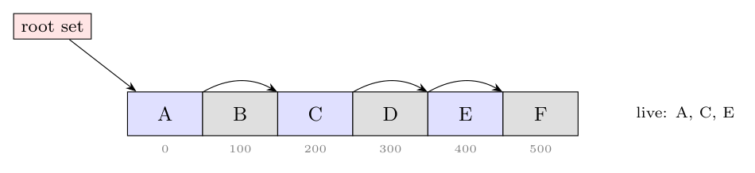
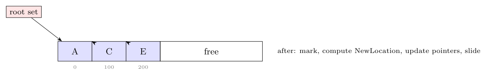
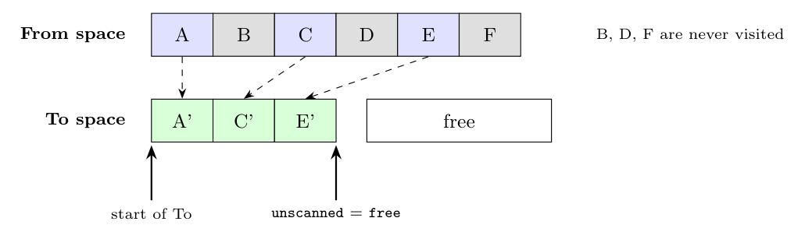

**Example scenario (assumption).** The heap holds six objects A-F of 100 bytes each at addresses 0, 100, ..., 500, in alphabetical order. The root set points to A, and A $\to$ C, C $\to$ E, D $\to$ F. B, D and F are unreachable.

**Basic mark-and-compact (in one heap):**

1. **Mark:** starting from the root set, mark the reachable objects A, C, E. B, D and F stay unmarked.
2. **Compute new addresses:** scan the heap from low to high addresses. Each marked object gets the next free address of the compacted area: `NewLocation(A) = 0`, `NewLocation(C) = 100`, `NewLocation(E) = 200`.
3. **Update references:** in the root set and in every marked object, replace each pointer `p` by `NewLocation(p)`: root $\to$ 0, A.ptr $\to$ 100, C.ptr $\to$ 200.
4. **Move:** slide each marked object to its new address, in address order.

**Cheney's copying collector (two semispaces).** Assume the From space is 0-599 and the To space starts at 1000.

1. Copy the root's object A to the To space at 1000; `unscanned` = 1000, `free` = 1100.
2. Scan A: its reference to C is copied to 1100 (`free` = 1200) and A.ptr becomes 1100.
3. Scan C: E is copied to 1200 (`free` = 1300) and C.ptr becomes 1200.
4. Scan E: no references. `unscanned` = `free`, so stop. The roles of the two semispaces are swapped, and B, D and F are never touched.

**Differences:**

| | Mark-and-compact | Cheney's copying |
|:--|:--|:--|
| Space | Works in place in one heap | Needs a second semispace: only half the memory is usable |
| Passes | Mark, then (at least) three passes over the whole heap (addresses, update, move) | One breadth-first pass that copies and scans reachable objects |
| Garbage | Visited when the heap is scanned | Never touched |
| Object order | Relative order preserved (sliding) | Breadth-first order; related objects end up close |
| Result | Live data contiguous at the low end; one free block | Live data contiguous in To space; one free block |

**Running times:**

- **Basic mark-and-compact:** proportional to the **number of chunks in the heap plus the total size of the reached objects** (the heap scans see every chunk; moving costs the size of the live data).
- **Cheney's copying collector:** proportional to the **total size of the reached objects** only, independent of the amount of garbage. This is very fast when most objects are dead.
