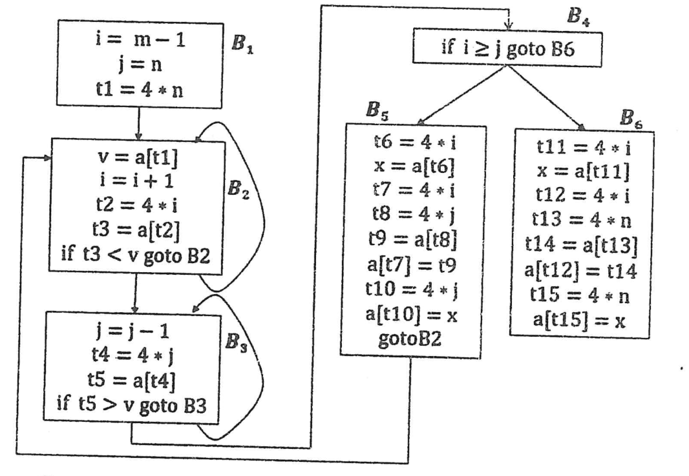

Consider the flow graph below derived from some three-address code. Optimize the code by discovering all possible semantic preserving transformations. For each of the transformations used, specify the name of the transformation.



*Figure for Question 5(a). The blocks, as drawn:*

```text
B1: i = m - 1             B4: if i >= j goto B6
    j = n
    t1 = 4 * n            B5: t6 = 4 * i           B6: t11 = 4 * i
                              x = a[t6]                x = a[t11]
B2: v = a[t1]                 t7 = 4 * i               t12 = 4 * i
    i = i + 1                 t8 = 4 * j               t13 = 4 * n
    t2 = 4 * i                t9 = a[t8]               t14 = a[t13]
    t3 = a[t2]                a[t7] = t9               a[t12] = t14
    if t3 < v goto B2         t10 = 4 * j              t15 = 4 * n
                              a[t10] = x               a[t15] = x
B3: j = j - 1                 goto B2
    t4 = 4 * j
    t5 = a[t4]
    if t5 > v goto B3

Edges: B1 -> B2, B2 -> B2, B2 -> B3, B3 -> B3, B3 -> B4, B4 -> B5, B4 -> B6, B5 -> B2
```
