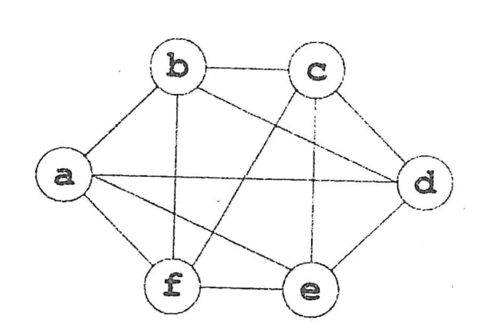

Consider the following register interference graph (RIG) derived from the flow graph of some three address code. What do the vertices and edges denote in such a RIG? Using the RIG, explain how the problem of global register allocation can be formulated as a graph coloring problem. Subsequently, find register allocation for the given program using Chaitin's algorithm. Assume three physical registers are available. Describe how the algorithm work and illustrate all steps of the algorithm for the given RIG. Make any other justified assumptions as required. What is a 'spill' in the context of the algorithm? Explain briefly how spilled variables are handled.

*Figure for Question 8(b): register interference graph on the vertices a, b, c, d, e, f.*
