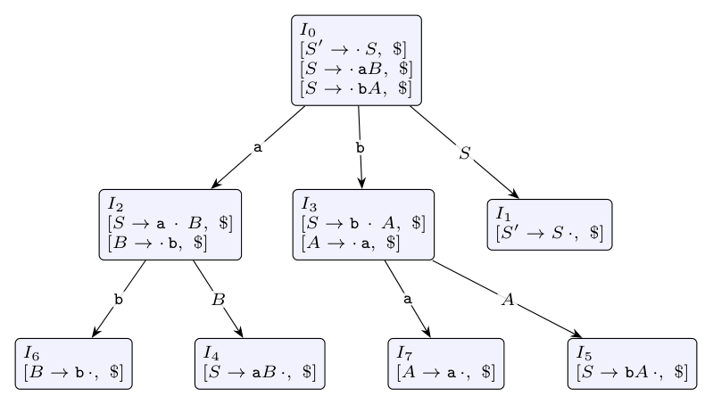

An LR(1) item $[A \to \beta_1 \cdot \beta_2, a]$ is **valid** for viable prefix $\gamma$ if there is a rightmost derivation

$$S' \overset{*}{\underset{rm}{\Rightarrow}} \delta A w \underset{rm}{\Rightarrow} \delta \beta_1 \beta_2 w$$

with $\gamma = \delta\beta_1$, and $a$ is the first symbol of $w$ (or \$ if $w$ is empty).

The grammar has only two rightmost derivations (augmented with $S' \to S$):

$$S' \Rightarrow S \Rightarrow aB \Rightarrow ab$$

$$S' \Rightarrow S \Rightarrow bA \Rightarrow ba$$

In both, $w = \epsilon$ at every step, so **every valid lookahead is \$**. The viable prefixes are $\epsilon, a, ab, aB, b, ba, bA$.

| Viable prefix | Item | Derivation used | Valid? |
|:--|:--|:--|:-:|
| a | $[S \to a \cdot B, \$]$ | $S' \Rightarrow S$ with $\delta=\epsilon$, $\beta_1=a$, $w=\epsilon$ | **Yes** |
| b | $[S \to b \cdot A, \$]$ | $S' \Rightarrow S \Rightarrow bA$, $\delta=\epsilon$, $\beta_1=b$ | **Yes** |
| b | $[A \to \cdot a, \$]$ | $S' \Rightarrow bA \Rightarrow ba$, $\delta=b$, $\beta_1=\epsilon$, $w=\epsilon$ | **Yes** |
| ab | $[B \to \cdot b, b]$ | for $B \to \cdot b$ we need $\delta = ab$, but $B$ is preceded only by $a$; lookahead $b$ impossible | **No** |
| baa | $[A \to A \cdot a, \$]$ | there is no production $A \to Aa$, and baa is not a viable prefix | **No** |
| ab | $[B \to b \cdot, \$]$ | $S' \Rightarrow aB \Rightarrow ab$, $\delta=a$, $\beta_1=b$ | **Yes** |
| ba | $[A \to a \cdot, \$]$ | $S' \Rightarrow bA \Rightarrow ba$, $\delta=b$, $\beta_1=a$ | **Yes** |
| a | $[A \to \cdot a, a]$ | $A$ only follows $b$, never $a$; lookahead would also have to be \$ | **No** |
| b | $[S \to b \cdot A, a]$ | $S$ is derived from $S'$ with $w=\epsilon$, so the lookahead must be \$ | **No** |

**Check with the LR(1) automaton:** $I_0 \xrightarrow{a} I_2 = \{[S \to a \cdot B,\$], [B \to \cdot b,\$]\}$, $I_0 \xrightarrow{b} I_3 = \{[S \to b \cdot A,\$], [A \to \cdot a,\$]\}$, $I_2 \xrightarrow{b} \{[B \to b \cdot,\$]\}$, $I_3 \xrightarrow{a} \{[A \to a \cdot,\$]\}$. The valid items for a prefix are exactly those in the state reached on it, which confirms the table.
