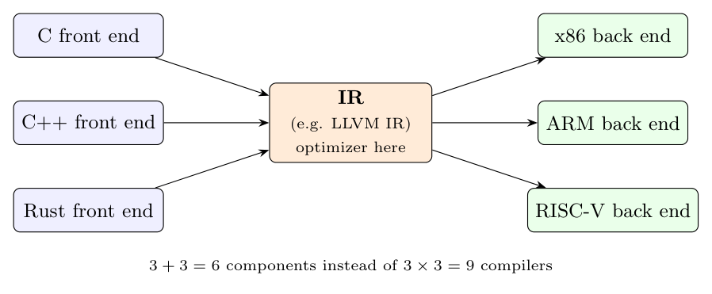

**Strictly necessary? No.** A simple one-pass compiler can translate source directly into target code during parsing (syntax-directed translation straight to assembly). Early compilers and some small compilers do this. But almost every production compiler uses one or more IRs, because of the benefits below.

**Benefits of an IR**

1. **Retargetability / reuse.** With an IR, the front end (language-dependent) and the back end (machine-dependent) are independent. For $m$ languages and $n$ machines we need $m + n$ components instead of $m \times n$ compilers.

Example: GCC and LLVM have front ends for C, C++, Fortran, Rust, ... all producing one IR (GIMPLE / LLVM IR), and back ends for x86, ARM, RISC-V, ... reading it.

2. **Machine-independent optimisation.** Optimisations such as common-subexpression elimination, constant folding, dead-code elimination and loop-invariant code motion are easy on a simple, explicit IR like three-address code, and can be written once for all targets.

Example: `a = b * c + b * c` becomes

```text
t1 = b * c
t2 = t1 + t1
a = t2
```

and the repeated `b * c` is visible and removed.

3. **Simpler code generation.** Source constructs (nested expressions, loops, short-circuit booleans) are broken into simple instructions with at most one operator and explicit jumps, which map easily to machine instructions.

4. **Modularity and clarity.** Each phase has a well-defined input and output, so phases can be developed and tested separately.

5. **Portability and interpretation.** An IR can be executed directly by a virtual machine, e.g. Java bytecode on the JVM: compile once, run anywhere.



**Kinds of IR:** high-level (syntax trees, DAGs), medium (three-address code: quadruples/triples, SSA form), low-level (close to machine code); also stack-based bytecode.
