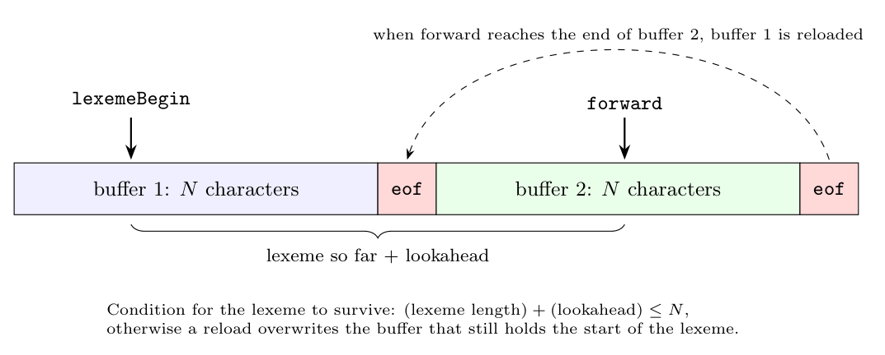

In the buffer-pair scheme, two buffers of $N$ characters each (typically $N$ = one disk block, e.g. 4096) are reloaded alternately. `lexemeBegin` marks the start of the current lexeme, and `forward` scans ahead.

**Effect of the buffer size:**

1. **Maximum lexeme length.** When `forward` runs off the end of one half, the other half is reloaded. If a lexeme is longer than $N$, `forward` would have to reload the half that still holds the start of the lexeme, which would overwrite the lexeme. So the language (or the implementation) must limit the length of identifiers, numbers and string literals to about $N$ characters, or handle long lexemes specially.

2. **Amount of lookahead.** `forward` can be at most about $N$ characters past `lexemeBegin`. A language whose tokens need long lookahead before a decision can be made cannot be scanned with a small buffer.

Example: in Fortran, `DO 5 I = 1.25` (an assignment to `DO5I`) and `DO 5 I = 1,25` (a loop) differ only at `.` or `,`. In PL/I, keywords are not reserved: `DECLARE (ARG1, ARG2, ..., ARGn)` can be a declaration or an array reference, and the lexer cannot tell until it sees what follows the `)`. The amount of lookahead is unbounded and needs a large buffer.

3. **Efficiency.** A larger $N$ means fewer reload operations (system calls), and sentinels make the end-of-buffer test cheap.

**Conclusion:** language designers keep lexemes and lookahead short (reserved keywords, limited identifier length, simple token forms) so that a fixed-size buffer pair is enough. The buffer size is therefore a practical limit on these language attributes.
