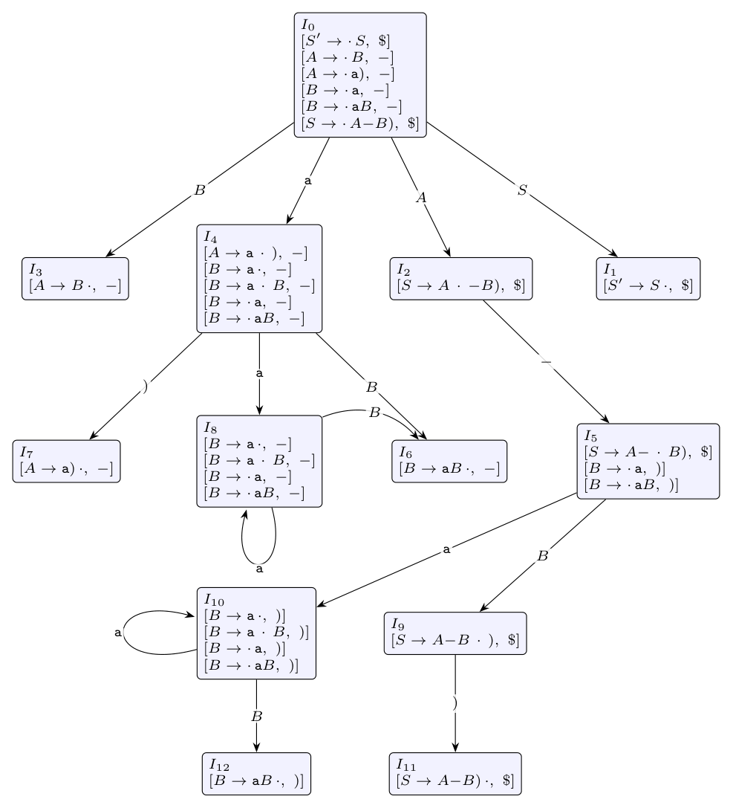

Terminals: `-`, `)`, `a`. Augment and number the productions:

$$(0)\ S' \to S \quad (1)\ S \to A - B\,) \quad (2)\ A \to B$$

$$(3)\ A \to a\,) \quad (4)\ B \to aB \quad (5)\ B \to a$$

**i. LR(1) automaton.** Closure rule: for $[A \to \alpha \cdot B\beta, x]$ add $[B \to \cdot\gamma, y]$ for every $y \in$ FIRST($\beta x$). (Lookaheads joined by / share one core.)

| State | Items | Transitions |
|:-:|:--|:--|
| $I_0$ | $[S' \to \cdot S, \$]$, $[S \to \cdot A - B), \$]$, $[A \to \cdot B, -]$, $[A \to \cdot a), -]$, $[B \to \cdot aB, -]$, $[B \to \cdot a, -]$ | S: 1, A: 2, B: 3, a: 4 |
| $I_1$ | $[S' \to S \cdot, \$]$ | |
| $I_2$ | $[S \to A \cdot - B), \$]$ | -: 5 |
| $I_3$ | $[A \to B \cdot, -]$ | |
| $I_4$ | $[A \to a \cdot ), -]$, $[B \to a \cdot B, -]$, $[B \to a \cdot, -]$, $[B \to \cdot aB, -]$, $[B \to \cdot a, -]$ | ): 7, B: 6, a: 8 |
| $I_5$ | $[S \to A - \cdot B), \$]$, $[B \to \cdot aB, )]$, $[B \to \cdot a, )]$ | B: 9, a: 10 |
| $I_6$ | $[B \to aB \cdot, -]$ | |
| $I_7$ | $[A \to a) \cdot, -]$ | |
| $I_8$ | $[B \to a \cdot B, -]$, $[B \to a \cdot, -]$, $[B \to \cdot aB, -]$, $[B \to \cdot a, -]$ | B: 6, a: 8 |
| $I_9$ | $[S \to A - B \cdot ), \$]$ | ): 11 |
| $I_{10}$ | $[B \to a \cdot B, )]$, $[B \to a \cdot, )]$, $[B \to \cdot aB, )]$, $[B \to \cdot a, )]$ | B: 12, a: 10 |
| $I_{11}$ | $[S \to A - B) \cdot, \$]$ | |
| $I_{12}$ | $[B \to aB \cdot, )]$ | |

*In the table, \$ inside an item is the endmarker.*

Canonical LR(1) table (no conflicts, so the grammar **is** LR(1)):

| State | a | - | ) | \$ | S | A | B |
|:-:|:-:|:-:|:-:|:-:|:-:|:-:|:-:|
| 0 | s4 | | | | 1 | 2 | 3 |
| 1 | | | | acc | | | |
| 2 | | s5 | | | | | |
| 3 | | r2 | | | | | |
| 4 | s8 | r5 | s7 | | | | 6 |
| 5 | s10 | | | | | | 9 |
| 6 | | r4 | | | | | |
| 7 | | r3 | | | | | |
| 8 | s8 | r5 | | | | | 6 |
| 9 | | | s11 | | | | |
| 10 | s10 | | r5 | | | | 12 |
| 11 | | | | r1 | | | |
| 12 | | | r4 | | | | |

**ii. Is it SLR(1)?** SLR uses the LR(0) items (the cores above, with $I_8$ and $I_{10}$ merged, and $I_6$ and $I_{12}$ merged) and reduces $A \to \alpha$ on every terminal in FOLLOW($A$).

$$\text{FOLLOW}(S) = \{\$\}, \quad \text{FOLLOW}(A) = \{-\}$$

$$\text{FOLLOW}(B) = \{\,-,\ )\,\}$$

The terminal `)` follows $B$ in $S \to A - B)$, and $A \to B$ adds FOLLOW($A$) = $\{-\}$.

Look at the LR(0) state for $I_4$:

$$A \to a \cdot ), \quad B \to a \cdot, \quad B \to a \cdot B, \quad B \to \cdot aB, \quad B \to \cdot a$$

On input `)`:

- $A \to a \cdot )$ says **shift** `)`;
- $B \to a \cdot$ says **reduce by $B \to a$**, because `)` $\in$ FOLLOW($B$).

This is a **shift/reduce conflict**, so the grammar is **not SLR(1)**. The conflict is spurious: in this state $B$ can only be followed by `-` (via $A \to B$, $S \to A - \ldots$). The LR(1) lookahead of $[B \to a\cdot, -]$ records this, and that is why the canonical LR(1) table has no conflict.
