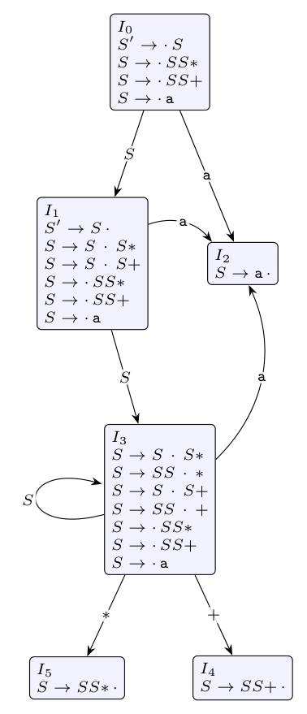

**The printed table cannot be used as it stands.** The grammar has only the nonterminal $S$ and productions 1-3, yet the table has GOTO columns $A$ and $B$ and the reduce actions r4 and r5. Following it literally on `aa*a+`: state 0 on a is s2; state 2 on a is s4; state 4 on `*` is r3 ($S \to a$), popping back to state 2, and GOTO(2, $S$) is empty. Even if the entry 3 is read as GOTO(2, $S$), state 3 has no action on `*`, so the parse **blocks**. But `aa*a+` is in the language ($S \Rightarrow SS+ \Rightarrow Sa+ \Rightarrow SS*a+ \Rightarrow \ldots$). So build the correct SLR(1) table and parse with it.

**LR(0) items** (augmented with $(0)\ S' \to S$):

| State | Items | Transitions |
|:-:|:--|:--|
| 0 | $S' \to \cdot S$, $S \to \cdot SS+$, $S \to \cdot SS*$, $S \to \cdot a$ | S: 1, a: 2 |
| 1 | $S' \to S \cdot$, $S \to S \cdot S+$, $S \to S \cdot S*$, $S \to \cdot SS+$, $S \to \cdot SS*$, $S \to \cdot a$ | S: 3, a: 2 |
| 2 | $S \to a \cdot$ | |
| 3 | $S \to SS \cdot +$, $S \to SS \cdot *$, $S \to S \cdot S+$, $S \to S \cdot S*$, $S \to \cdot SS+$, $S \to \cdot SS*$, $S \to \cdot a$ | +: 4, \*: 5, S: 3, a: 2 |
| 4 | $S \to SS+ \cdot$ | |
| 5 | $S \to SS* \cdot$ | |

FOLLOW($S$) = { a, +, \*, \$ }, since an $S$ can be followed by another $S$, by + or \*, or end the input.

**SLR(1) table:**

| State | a | + | * | \$ | GOTO S |
|:-:|:-:|:-:|:-:|:-:|:-:|
| 0 | s2 | | | | 1 |
| 1 | s2 | | | acc | 3 |
| 2 | r3 | r3 | r3 | r3 | |
| 3 | s2 | s4 | s5 | | 3 |
| 4 | r1 | r1 | r1 | r1 | |
| 5 | r2 | r2 | r2 | r2 | |

**Parsing `aa*a+`:**

| Stack (states) | Symbols | Input | Action |
|:--|:--|--:|:--|
| 0 | | aa\*a+\$ | shift 2 |
| 0 2 | a | a\*a+\$ | reduce $S \to a$ (r3), GOTO(0,S) = 1 |
| 0 1 | S | a\*a+\$ | shift 2 |
| 0 1 2 | S a | \*a+\$ | reduce $S \to a$, GOTO(1,S) = 3 |
| 0 1 3 | S S | \*a+\$ | shift 5 |
| 0 1 3 5 | S S \* | a+\$ | reduce $S \to SS*$ (r2), GOTO(0,S) = 1 |
| 0 1 | S | a+\$ | shift 2 |
| 0 1 2 | S a | +\$ | reduce $S \to a$, GOTO(1,S) = 3 |
| 0 1 3 | S S | +\$ | shift 4 |
| 0 1 3 4 | S S + | \$ | reduce $S \to SS+$ (r1), GOTO(0,S) = 1 |
| 0 1 | S | \$ | **accept** |

The reductions in reverse give the rightmost derivation $S \Rightarrow SS+ \Rightarrow Sa+ \Rightarrow SS*a+ \Rightarrow Sa*a+ \Rightarrow aa*a+$.
