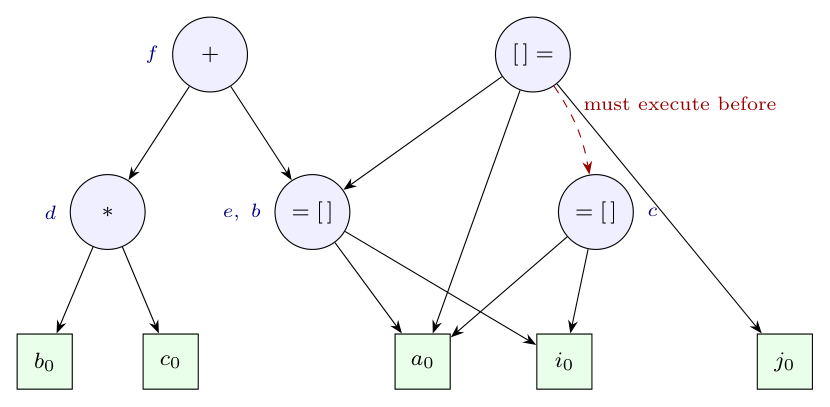

**Use of DAGs for basic blocks.** Build a DAG with one leaf per initial value and one node per distinct operation, re-using an existing node when the same operator with the same children is seen again. This lets us:

- find **local common subexpressions** (a node gets several labels);
- remove **dead code** (delete roots with no live labels);
- apply **algebraic identities**;
- then **reassemble** a shorter block from the DAG.

Array accesses need care: `x = a[i]` creates an `=[]` node, and an assignment `a[j] = y` creates a `[]=` node that **kills** every node depending on `a`, because `j` might equal `i`.

**Building the DAG:**

| Statement | Action |
|:--|:--|
| `d = b * c` | leaves $b_0$, $c_0$; node $n_1$: `*`($b_0$, $c_0$), label d |
| `e = a[i]` | leaves $a_0$, $i_0$; node $n_2$: `=[]`($a_0$, $i_0$), label e |
| `f = e + d` | node $n_3$: `+`($n_2$, $n_1$), label f |
| `b = a[i]` | `=[]`($a_0$, $i_0$) already exists and is not killed: attach b to $n_2$ (labels e, b) |
| `a[j] = b` | leaf $j_0$; node $n_4$: `[]=`($a_0$, $j_0$, $n_2$). This **kills** $n_2$ for further reuse |
| `c = a[i]` | $n_2$ is killed, so create a new node $n_5$: `=[]`($a_0$, $i_0$), label c (it must follow $n_4$) |



Note that `b` gets a new value, so the leaf $b_0$ (old `b`) is used by $n_1$, while the label b now sits on $n_2$.

**Optimisation (d and f not live on exit):** $n_3$ (f) is a root with no live label, so delete it. Then $n_1$ (d) has no parent and no live label, so delete it too. That removes the `*` and the `+`. Reassemble the block, computing $n_2$ once and copying it to its second label:

```text
e = a[i]
b = e
a[j] = e
c = a[i]
```

The first two `a[i]` loads were merged (common subexpression). The third cannot be merged, because `a[j] = b` may have changed `a[i]`. `d = b * c` and `f = e + d` were removed as dead code. Four statements remain instead of six, with two loads instead of three.
