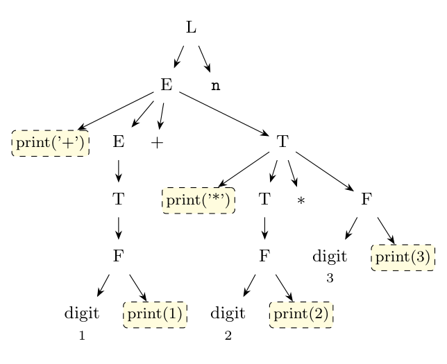

**Why it cannot be done during parsing.** An action must be executed when everything to its left has been recognised. Here `print('+')` and `print('*')` are at the **left end** of their bodies, before $E_1$ and $T_1$.

**Top-down (LL) parsing.**

- The grammar is left recursive ($E \to E_1 + T$, $T \to T_1 * F$), so a predictive parser cannot use it at all.
- Even ignoring that, the parser would have to print `+` as soon as it decides to expand $E \to E_1 + T$. That decision needs to know that a `+` will come later, after an arbitrarily long $E_1$. With finite lookahead it cannot know this.

**Bottom-up (LR) parsing.** To execute an action in the middle (here at the start) of a body, replace it with a marker nonterminal $M \to \epsilon$ with the action attached: $E \to M\, E_1 + T$. The parser must reduce $\epsilon$ to $M$ **before** it has read any part of $E_1$. At that point, seeing a digit, it cannot tell whether this digit begins an $E_1 + T$, a $T_1 * F$, or just $F$. The markers give shift/reduce and reduce/reduce conflicts, so no LR parser exists for the modified grammar.

In both cases, the prefix form needs the operator to be printed before its operands. That requires knowing the structure of the whole subexpression first, which a parser reading left to right does not have when it must print.

**How to implement it (parse-tree method):**

1. Ignore the actions and parse the input with any suitable parser (e.g. LR, which handles the left-recursive grammar), building the parse tree.
2. For each interior node, place each action as an extra child, in the position it has in the production body, e.g. node $E$ with children `{print('+')}`, $E_1$, `+`, $T$.
3. Do a **preorder (left-to-right, depth-first) traversal** of the tree, executing each action node when it is visited.

For `1 + 2 * 3 n`: the root's $E \to E_1 + T$ prints `+`; then $E_1 \to T \to F \to$ digit prints `1`; then $T \to T_1 * F$ prints `*`, then `2`, then `3`. Output: **`+ 1 * 2 3`**, which is the prefix form. Any SDT can be implemented this way, at the cost of building the whole tree first.

