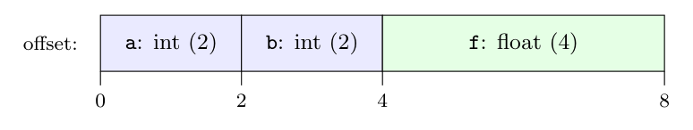

**Two applications of types (4 marks):**

1. **Type checking:** the compiler uses types and logical rules to verify that operands match their operators, e.g. that `&&` gets booleans, that a function is called with the right number and types of arguments, and that an array is indexed with an integer. Errors are caught at compile time.
2. **Translation:** types determine the **storage** needed for a name (its width) and hence its relative address (offset). They also decide which instruction to generate (integer vs floating-point addition), where coercions are needed, and how array addresses are computed.

**SDT for declarations (8 marks).** Use a global variable `offset`, set to 0 before the declarations. Each name is entered in the symbol table with its type and the current offset; the offset then grows by the width of the type.

```text
P  ->  { offset = 0; }  D

D  ->  T id ;   { top.put(id.lexeme, T.type, offset);
                  offset = offset + T.width; }
       D1

D  ->  eps

T  ->  int      { T.type = integer; T.width = 2; }

T  ->  float    { T.type = float;   T.width = 4; }
```

`top.put` creates a symbol-table entry for the identifier in the current table `top`. The action between `;` and $D_1$ is executed after `T id ;` has been seen, i.e. after $T$'s synthesized attributes are known. (The marker-free form works because `offset` is a global variable; in an LR implementation, the leading action becomes a marker $M \to \epsilon$.)

**Offsets for `int a; int b; float f;`:**

| Declaration | `T.type`, `T.width` | Offset given | `offset` afterwards |
|:--|:--|:-:|:-:|
| (start) | | | 0 |
| `int a;` | integer, 2 | **0** | 2 |
| `int b;` | integer, 2 | **2** | 4 |
| `float f;` | float, 4 | **4** | 8 |



So `a` is at offset 0, `b` at offset 2 and `f` at offset 4. The declarations occupy 8 bytes.
