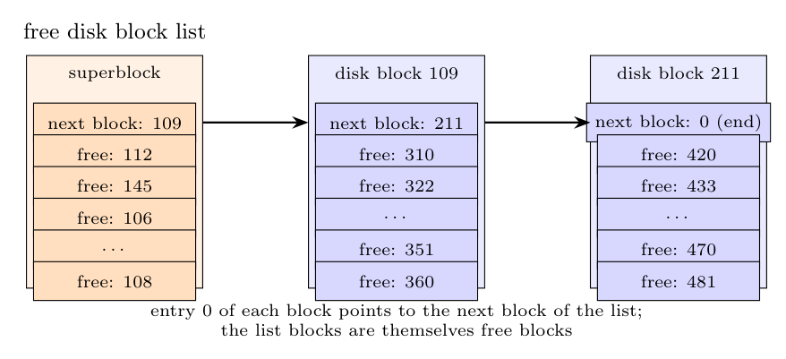

**(i) Superblock free-inode list.** A **fixed-size array** (about 100 entries) of free inode numbers in the superblock, plus the **remembered inode**. It is only a **partial list**: when it empties, the kernel scans the on-disk inode list for inodes whose type is 0 (free) and refills the array. Freed inodes are added only while there is room.

**(ii) Superblock free disk-block list.** A **linked list of blocks**: the superblock holds an array of up to about 100 free block numbers; entry 0 holds the number of a free block which itself contains another array of free block numbers (with entry 0 pointing to the next such block), and so on. It is a **complete** list of all free blocks.

When a block is allocated, the kernel takes the last entry of the superblock array; if it was the entry that points to the next block, that block's contents (a new array) are read into the superblock. When a block is freed, its number is added to the array; if the array is full the freed block becomes the new list block (its contents are overwritten with the full array) and is linked in at entry 0.

**Reason for the different structures.**

- A **free inode can be recognised by scanning**: its type field is 0, so the free-inode list need not be complete; it can be rebuilt from the inode list on disk. An inode is small and its number is easy to guess; the list is only a cache that saves scanning.
- A **free data block contains no marker** (its contents are arbitrary old data), so the system must remember *exactly* which blocks are free: a complete list is needed. Because free blocks are plentiful, the list can be stored **in the free blocks themselves**, which costs no extra space and needs only one disk access per 100 allocations.
