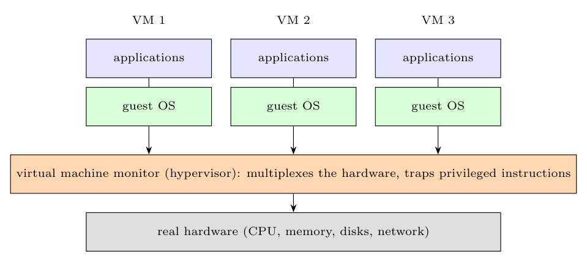

**Architecture.** A **virtual machine monitor (VMM, hypervisor)** runs directly on the **real hardware** (type 1) or on a host OS (type 2) and **multiplexes the hardware** among several **virtual machines**. Each VM is an exact copy of the hardware (virtual CPU, memory, disks, network, interrupts) on which an unmodified **guest operating system** with its applications runs, believing it owns the machine. The guest's **privileged instructions** and I/O are **trapped** by the VMM (the guest kernel really runs in user mode and the "virtual kernel mode" is emulated), which performs the operation on the virtual device or maps it to the real device; memory is virtualised with shadow page tables or nested paging.

**Disadvantages**

- **Performance overhead:** trapping and emulating privileged instructions, extra translation of memory addresses and double scheduling make a VM slower than a native machine (reduced by hardware support such as Intel VT-x/AMD-V).
- **Complexity:** the VMM must virtualise the CPU (some instructions such as x86 sensitive-but-unprivileged ones are hard to trap), memory, I/O devices and interrupts; a large trusted component whose bugs affect all VMs.
- **Resource duplication:** each VM runs a whole OS, using more memory and disk, and idle guests still consume resources.
- **I/O performance and sharing:** devices are multiplexed, so some are not fully shared; one VM can disturb the others (noisy neighbour) and there is a **single point of failure** (the host).
