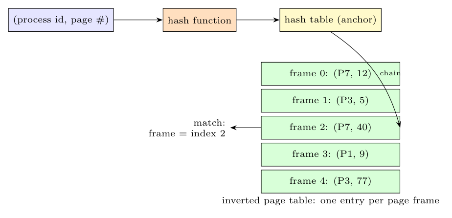

**What it is.** A page table that has **one entry per physical page frame** (not per virtual page). Each entry records **which (process id, virtual page number) is currently stored in that frame**. There is one such table for the whole system.

**Why it is needed.** With 64-bit virtual addresses a normal page table with an entry per virtual page is impossibly large (e.g. $2^{52}$ entries). An inverted table needs only $\text{RAM size}/\text{page size}$ entries (e.g. 1 GB of RAM with 4 KB pages: 262,144 entries, about 2 MB), **independent of the size of the virtual address space and of the number of processes**.

**Making the search efficient.** Translation means finding the entry whose (process, page) matches the virtual address, and the frame number is the **index** of that entry; a linear search of 262,144 entries on every reference is far too slow. The solutions:

- a **hash table** keyed by (process id, virtual page number) points to the head of a short **chain** of entries (entries are linked by a chain field); the hash gives an index and only a few entries on the chain are compared;
- a **TLB** caches the translations, so the search is needed only on TLB misses.

