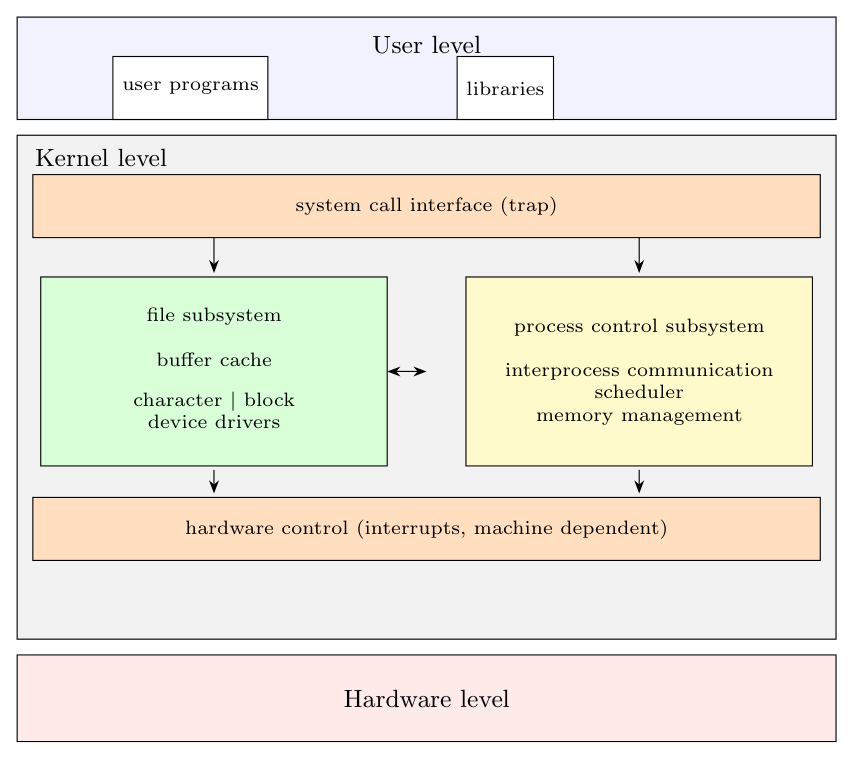

**Levels.** User programs and libraries run at *user level* and enter the kernel through the **system call interface** (a trap). The kernel has two main subsystems; below them the **hardware control** layer handles interrupts and machine-dependent details, and the hardware sits at the bottom.

**Subsystems and their interaction**

- **File subsystem:** manages files (allocation, free space, access control, i-nodes) and moves data between the file system and user space. It uses the **buffer cache** to reduce disk accesses, and the **device drivers** (*block* drivers for disks/tapes through the buffer cache, *character* drivers for raw devices and terminals) to talk to the hardware.
- **Process control subsystem:** creation, termination and scheduling of processes; **interprocess communication** (signals, pipes, messages, shared memory), the **scheduler** (which process gets the CPU) and **memory management** (allocation of memory, swapping/paging).
- **Interaction.** The two subsystems interact when a program is loaded for execution: the file subsystem reads the executable into memory, and the process control subsystem allocates memory for it; the memory manager also uses the file subsystem/disk driver to swap processes. The scheduler lets the process control subsystem decide which process runs while the others wait for file-system I/O.
