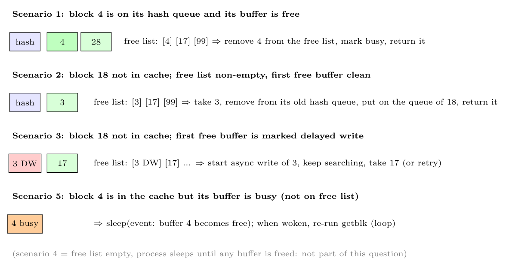

`getblk(device, block)` returns a locked buffer for the block. If the free list is **not empty**, there are four possible scenarios (the fifth, "free list empty", needs the list to be empty):

- **Scenario 1: the block is in the hash queue and its buffer is free.** Mark the buffer busy (lock it), remove it from the free list and return it. (A cache hit.)
- **Scenario 2: the block is not in the cache; a clean buffer is on the free list.** Take the buffer at the head of the free list, remove it from the free list, mark it busy, remove it from its old hash queue and put it on the hash queue of the new block, then return it.
- **Scenario 3: the block is not in the cache and the first buffer on the free list is marked delayed write.** Start an **asynchronous write** of that buffer to disk and continue searching: take the next buffer on the free list (which is then handled as scenario 2, or again as scenario 3). The delayed-write buffer is freed when its write completes.
- **Scenario 5: the block is in the cache but its buffer is busy** (another process holds it, so it is not on the free list). The process marks the buffer "wanted" and **sleeps** until that buffer is freed; after the wakeup it restarts `getblk` from the beginning (because the buffer may have been reassigned meanwhile).

(Scenario 4, the free list being empty, makes the process sleep until *any* buffer is released.)
