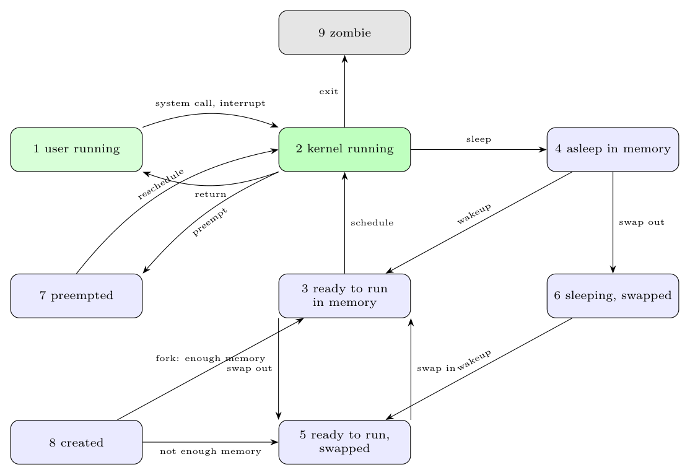

**States:** (1) *user running*, (2) *kernel running*, (3) *ready to run in memory*, (4) *asleep in memory*, (5) *ready to run, swapped*, (6) *sleeping, swapped*, (7) *preempted* (the process returns from kernel to user mode but the kernel schedules another process; it is like state 3), (8) *created* (newly created by `fork`, in a transition state), (9) *zombie* (the process called `exit`; only the process table entry remains until the parent waits).

**Transitions.**

- *user running* $\to$ *kernel running*: system call or interrupt; *kernel running* $\to$ *user running*: return from the system call/interrupt.
- *kernel running* $\to$ *asleep in memory*: the process sleeps (waiting for I/O or a resource); $\to$ *ready to run in memory*: **wakeup**.
- *ready to run in memory* $\to$ *kernel running*: the **scheduler** picks the process (it runs in kernel mode first, then returns to user mode).
- *kernel running* $\to$ *preempted*: the kernel switches to a higher-priority process on return to user mode; *preempted* $\to$ *kernel running*: **reschedule**.
- *ready in memory* $\leftrightarrow$ *ready swapped*, *asleep in memory* $\to$ *sleeping swapped*: **swap out/in** by the swapper when memory is short; *sleeping swapped* $\to$ *ready swapped*: wakeup.
- *created* $\to$ *ready in memory* (or *ready swapped* if there is not enough memory): `fork`.
- *kernel running* $\to$ *zombie*: `exit`.
