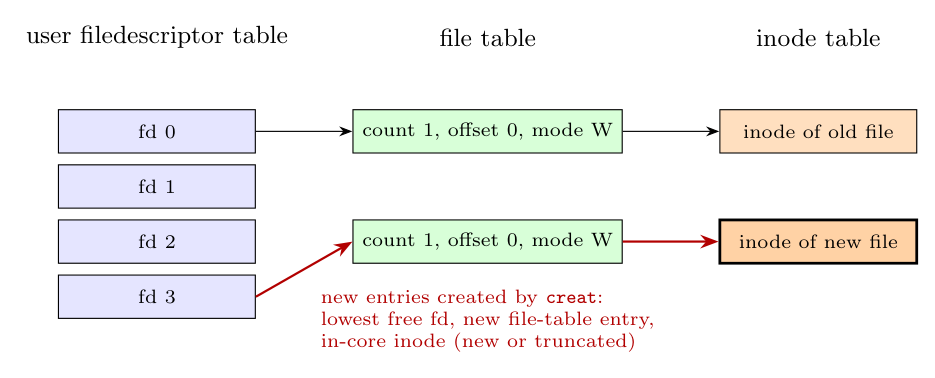

```text
algorithm open
input:  file name; flags (read/write/...); permission modes (for creation)
output: file descriptor
{
    convert file name to inode (algorithm namei);
    if (file does not exist or not permitted access) return (error);
    allocate file table entry for inode, initialise count, offset;
    allocate user file descriptor entry, set pointer to file table entry;
    if (truncate flag) free all file blocks (algorithm free);
    unlock (inode);                     /* inode was locked in namei */
    return (user file descriptor);
}
```

**What happens.** (1) `namei` converts the path name to an **in-core inode** (allocating it with `iget` if necessary, and incrementing its reference count). (2) The kernel checks that the file exists and that the process has the requested access (read/write permission, directory not opened for writing). (3) It allocates an entry in the **file table** with the access mode, the **offset (0)** and a count of 1, pointing to the in-core inode. (4) It allocates the **lowest free slot in the user file descriptor table** (in the u area) pointing to this file-table entry. (5) It **unlocks** the inode (it remains allocated, with its reference count) and returns the index of the slot, the **file descriptor**, which later `read`/`write` calls use.



*(Figure: the user file descriptor table, file table and inode table; the red entries are the new ones; for `open` the inode is the existing one.)*
