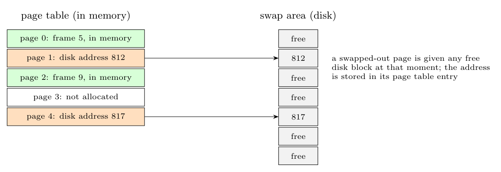

**Dynamic allocation of swap space.** Instead of reserving a fixed area on the disk for each process, disk space is allocated for a page **only when the page is swapped out**: the kernel takes **any free block of the swap area** (found, e.g., with a bitmap or free list of swap blocks), writes the page there and records the **disk address in the page-table entry** of that page (the entry no longer holds a frame number, since the page is not in memory). When the page is brought back in, the kernel reads it from that address and may free the block.

- **Advantages:** space is used only for pages actually swapped out (no waste for pages never swapped), and processes can grow without reserving space; the swap area can be smaller than the sum of the address spaces.
- **Disadvantages:** each page needs its **disk address stored** (in the page table, so more memory in the tables), and the swapped pages of a process are scattered over the disk (no locality), so the allocation can fail when the swap area is full.
