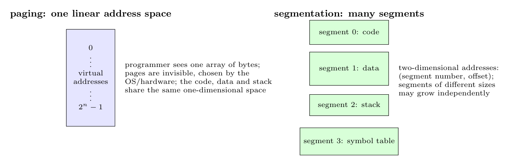

- **Paging:** the programmer sees **one linear (one-dimensional) virtual address space**, an array of bytes numbered $0\ldots2^n-1$ that holds code, data and stack together; the division into fixed-size pages is invisible and done by the system. An address is a single number.
- **Segmentation:** the programmer sees a **collection of independent segments** (code, data, stack, tables), each with its own linear space starting at 0 and its own size, which can grow or shrink separately. An address is **two-dimensional**: (segment number, offset).
