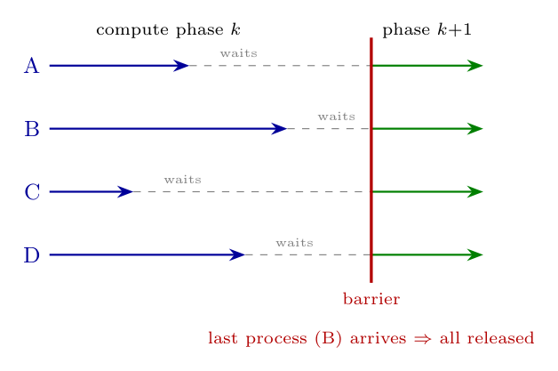

**Barrier.** A synchronisation mechanism for **groups of processes (or threads)**: a process that reaches the barrier **blocks** until **all** the processes of the group have reached it; when the last one arrives, all are released and continue.

**Example scenario.** In a parallel scientific computation (e.g. relaxation on a large matrix or a weather simulation) each process computes one part of the matrix in phase $k$, but phase $k+1$ needs the results of the *neighbouring* parts computed in phase $k$. A barrier at the end of each phase ensures that no process starts the next iteration with stale data: fast processes wait for the slowest one. The same pattern is used for multi-pass algorithms and parallel loops (e.g. `pthread_barrier_wait`).
