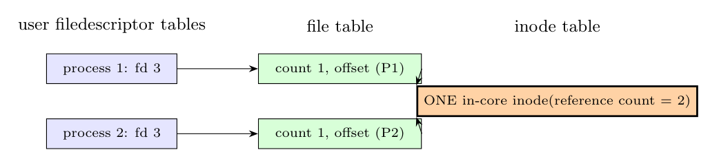

**Only one in-core inode is allocated.** The inode table holds at most one in-core copy of a given disk inode: when the second process opens the file, `namei`/`iget` finds the inode already in the table and just **increments its reference count** (to 2). Each `open` call, however, creates its **own file-table entry** (with its own file offset) and its own entry in the process's user file descriptor table.

So there are 2 user-file-descriptor entries (one per process), 2 file-table entries (independent offsets) and **1 in-core inode**.
