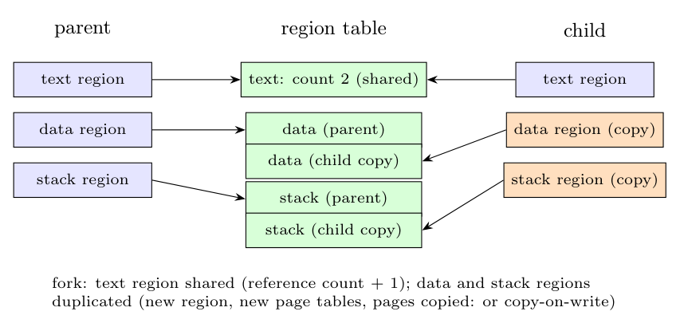

In the UNIX kernel a process's address space is made of **regions** (text, data, stack, shared memory), described by the **per-process region table** (pregion entries: virtual address, permissions, pointer to a region table entry) and the **region table** (the regions themselves with page tables and a reference count).

When the parent calls `fork`, the kernel creates the child's process-table entry and the child's per-process region table, and then for each region of the parent:

- **Text (code) region:** it is read-only and can be **shared**: the kernel does not copy it; it only **increments the reference count** of the region and attaches the same region to the child (`attachreg`).
- **Data and stack regions:** they are private and writable, so the kernel **duplicates** them (`dupreg`): it allocates a **new region table entry, a new page table and new memory pages**, and **copies** the contents of the parent's pages into them (or, in systems with copy-on-write, copies a page only on the first write).
- **Shared-memory regions:** shared as for text (reference count incremented).
- Then the child's **u area** and kernel stack are made by copying the parent's; the child gets the saved context layer so that it returns from `fork` with the value 0, while the parent receives the child's process ID.

Afterwards parent and child run independently: they share the text but each has its own data and stack.
