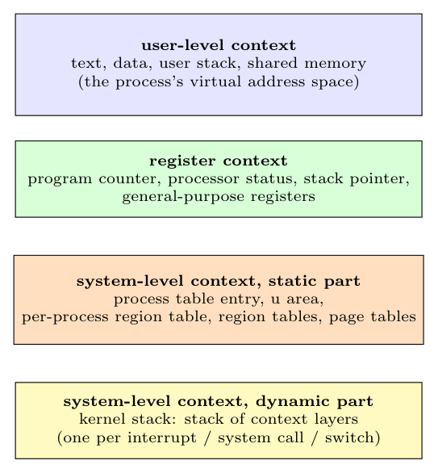

The **context of a process** is its state, defined by its address space, the contents of the hardware registers and the kernel data structures that relate to it. It has **three components**:

1. **User-level context:** the contents of the **user address space**: the **text** (code), the **data** (initialised and uninitialised data, heap), the **user stack** and **shared-memory** regions.
2. **Register context:** the **program counter** (address of the next instruction), the **processor status register** (mode, interrupt level, condition codes), the **stack pointer**, and the **general-purpose registers**.
3. **System-level context:** information that the kernel needs to manage the process, with two parts:
   - **static part** (fixed size for the life of the process): the **process table entry** (state, ID, priority, signals), the **u area** (file descriptors, current directory, limits), and the **per-process region table/region table entries and page tables** that map the user address space;
   - **dynamic part:** the **kernel stack**, which holds a **stack of context layers**: one layer is pushed for each interrupt, system call or context switch (it holds the saved register context to return to the previous layer) and popped on return.

The process runs *in* its user-level context in user mode, and in its system-level context in kernel mode; when it is not running, the register context is saved in the current context layer.
