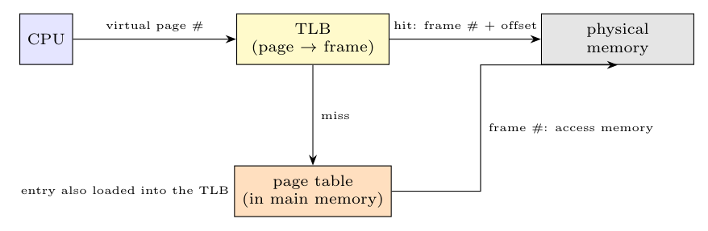

1. The CPU issues a virtual address (page number + offset); the page number is sent to the **TLB**, which is searched **in parallel** for the entry (page, frame, protection).
2. **TLB hit:** the frame number from the TLB is combined with the offset to form the physical address, which accesses **physical memory** directly, with no page-table access.
3. **TLB miss:** the MMU (or the OS) reads the **page table** in main memory to find the frame; if the page is present, the **entry is loaded into the TLB** (replacing an old entry) and the access is performed; if not present, a page fault occurs.
