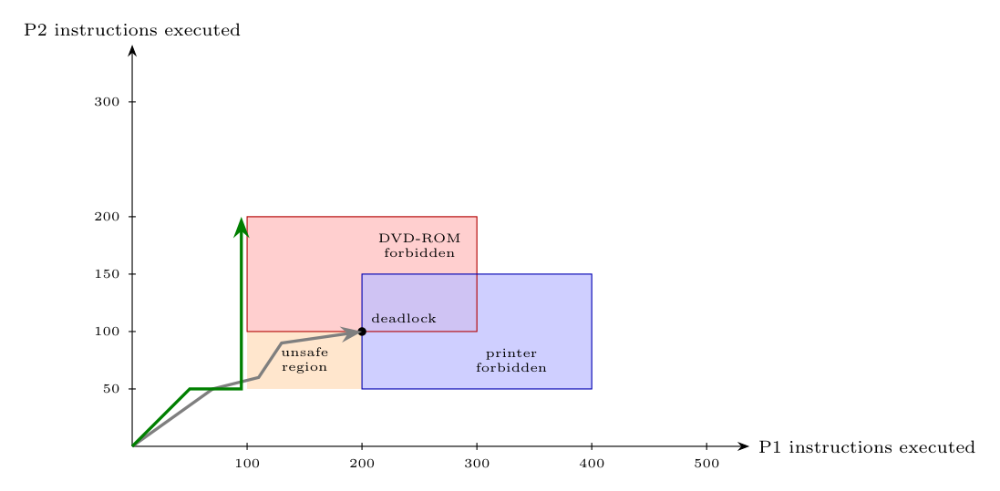

A joint state $(x,y)$: P1 has executed $x$ of its 500 instructions and P2 $y$ of its 300. Resource holding intervals:

| Resource | P1 holds for $x$ in | P2 holds for $y$ in |
|:--|:-:|:-:|
| DVD-ROM | $[100,300]$ | $[100,200]$ |
| printer | $[200,400]$ | $[50,150]$ |

**Assumptions:** one processor, so the joint path moves right (P1) or up (P2); mutual exclusion on both resources.

- **Forbidden rectangles** (both processes would hold the same resource): DVD-ROM: $100\le x\le300,\ 100\le y\le200$; printer: $200\le x\le400,\ 50\le y\le150$ (they overlap).
- **Deadlock point** $D=(200,100)$: P1 holds the DVD-ROM (since 100) and requests the printer (at 200); P2 holds the printer (since 50) and requests the DVD-ROM (at 100). Neither can move: right is blocked by the printer rectangle, up by the DVD-ROM rectangle: a **circular wait**.
- **Unsafe region:** the box $100\le x\le200,\ 50\le y\le100$ (shaded). Any path that enters it can only continue right or up into a forbidden rectangle or the deadlock point $D$, so it **inevitably deadlocks**. A path that stays outside (the green one: P2 runs first to $y=200$ while P1 is still before instruction 100, or P1 runs first beyond 200 before P2 reaches 50) is **safe**.

So the system is deadlocked/unsafe exactly if the scheduler lets both processes enter the shaded box: the OS should not grant the second request there.
