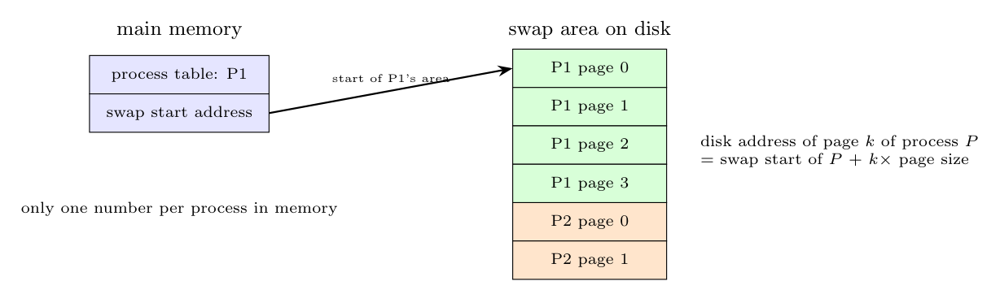

When each process needs a **fixed amount of memory**, a **static swap area** can be reserved for it:

- When the process is created, a **contiguous area on the disk, as large as the process's address space,** is allocated in the swap area (a partition).
- The **disk address of the area** (a single number) is stored in the **process table**.
- To swap page $k$ out or in, the kernel computes its disk address as

$$\text{address}(P,k)=\text{swap area start of }P+k\times\text{page size}$$

so **no table of per-page disk addresses is needed**, and nothing but one number per process uses main memory. Pages go back to the same place every time (no fragmentation search); when the process terminates, the area is freed.

*Drawback:* the whole space is reserved even for pages never used, and the swap area must be at least as large as the sum of the address spaces.
