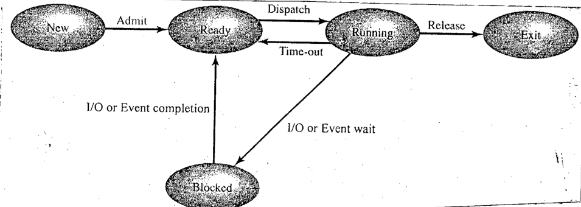

The process state transition diagram for a uniprocessor system is shown in the following figure.

Assume that there are only 5 processes named P1, P2, P3, P4 and P5 in the system. At time 0, each of the processes is in **Ready** state. The scheduler operates in round-robin fashion.

All events except dispatch that occur from time 5 to time 48 listed below:

- At time 5: P1 executes a command to read from disk.
- At time 15: P3's time slice expires.
- At time 18: P4 executes a command to write to disk.
- At time 20: P2 executes a command to read from disk.
- At time 23: P5 goes to sleep for 7 unit of time.
- At time 24: P3 executes a command to write to disk.
- At time 30: P5 wakes up from sleep.
- At time 33: An interrupt occurs from disk unit 2: P2's read is complete.
- At time 36: An interrupt occurs from disk unit 3: P1's read is complete.
- At time 38: P5 terminates.
- At time 40: An interrupt occurs from disk: P3's write is complete.
- At time 48: An interrupt occurs from disk: P4's write is complete.

Now infer the state of each process using the available information for each of the cases:

(i) At time 22

(ii) At time 37

(iii) At time 47
