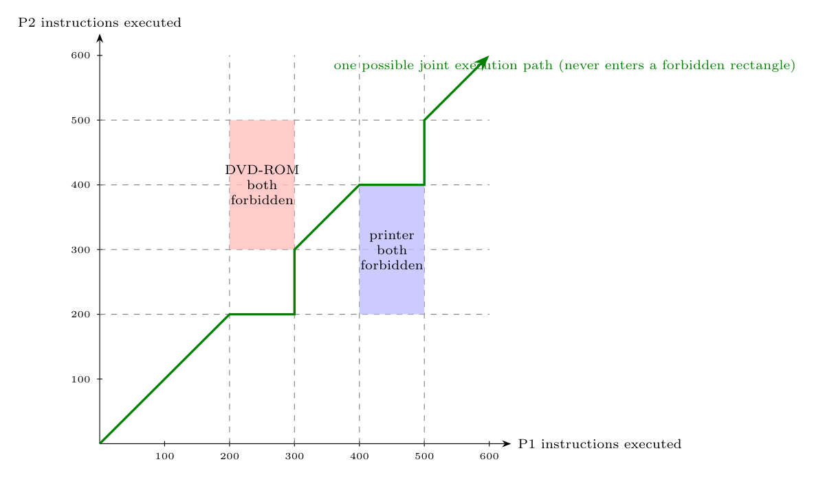

Each point $(x,y)$ is a joint state: P1 has executed $x$ instructions and P2 $y$ instructions. A process **holds** a resource between its request and release instruction:

| Resource | P1 holds it for $x$ in | P2 holds it for $y$ in |
|:--|:-:|:-:|
| DVD-ROM | $[200,300]$ | $[300,500]$ |
| printer | $[400,500]$ | $[200,400]$ |

Because each resource can be used by only one process at a time (**mutual exclusion**), the joint states in which both would hold the same resource are **forbidden**:

- **DVD-ROM rectangle:** $200\le x\le300,\ 300\le y\le500$.
- **Printer rectangle:** $400\le x\le500,\ 200\le y\le400$.

The execution path can move only right (P1 runs) or up (P2 runs) and may not enter these rectangles. The green line shows one legal execution. Since P1 releases the DVD-ROM (300) before it asks for the printer (400), and P2 releases the printer (400) before it releases the DVD-ROM (500) while it never needs more than the resources shown at the corners, **no state leads to a deadlock**: there is no unsafe region (a path can always continue to the upper right corner).
