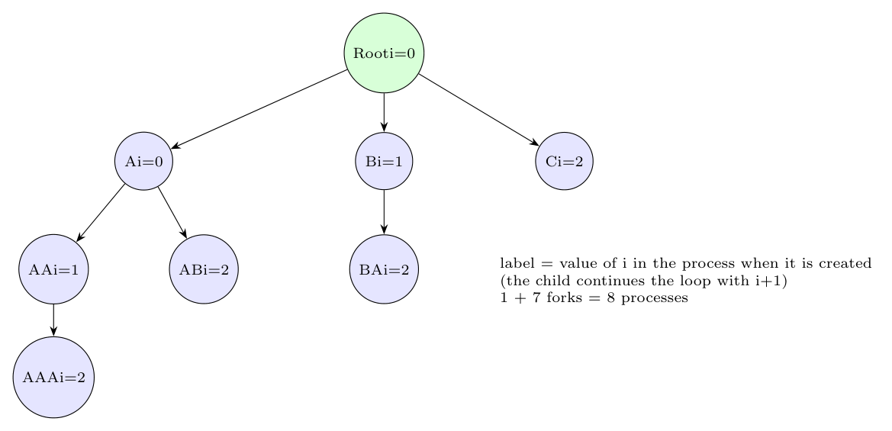

`i` is a **global** variable, but after each `fork` every process has **its own copy** (separate address space). At `fork` the child gets the parent's current value of `i`, then both increment it and continue the loop. Hence a child created in iteration $i=k$ **starts with $i=k$**, continues the loop with $k+1,\dots,2$ and creates children of its own.

- Iteration $i=0$: Root forks **A** ($i=0$). Now two processes, both with $i=1$ after `i++`.
- Iteration $i=1$: Root forks **B** ($i=1$), A forks **AA** ($i=1$). Four processes, all with $i=2$.
- Iteration $i=2$: Root forks **C** ($i=2$), A forks **AB** ($i=2$), B forks **BA** ($i=2$), AA forks **AAA** ($i=2$). Eight processes; all have $i=3$ and end.

Total: $2^3=8$ processes (7 created by `fork`).
