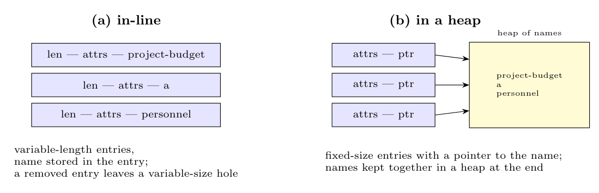

Two ways to store long file names in a directory:

**(a) In-line.** Each entry has a **header** (entry length, attributes) followed by the **file name** itself; entries are of variable length (padded to a word boundary).

- *Advantages:* simple; all the information of a file (attributes and name) is in one place, so one access finds it; no extra storage management.
- *Disadvantages:* entries have different lengths, so when a file is **removed** it leaves a **variable-size gap** that a new file may not fit exactly (fragmentation inside the directory); an entry may span several disk blocks/pages (a page fault in the middle of reading an entry); a directory search must step through entries one by one.

**(b) In a heap.** The directory has **fixed-size entries** (attributes plus a **pointer to the name**), and the names are stored in a **heap** at the end of the directory.

- *Advantages:* **fixed-size entries**, so removing a file frees a slot that any new file can use; entries (and hash tables) are easy to search, and many names can share one block; compact.
- *Disadvantages:* **heap management** is needed (allocating, freeing and compacting names); an **extra pointer dereference** (and possibly an extra block access) to read a name; the heap can also become fragmented.
