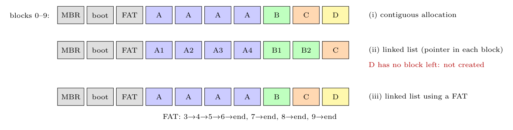

The SSD has 10 blocks of 1 MB: block 0 MBR, block 1 boot block, block 2 superblock/FAT, so the **7 blocks 3-9 hold data**. File sizes in blocks: A $3.6\to4$, B $1.0\to1$, C $0.9\to1$, D $0.6\to1$ (a block is allocated whole).

**(i) Contiguous allocation.** Each file gets consecutive blocks: **A: blocks 3-6** (0.4 MB wasted in block 6), **B: block 7**, **C: block 8**, **D: block 9**. The 7 blocks are exactly used (internal fragmentation only).

**(ii) Linked-list allocation.** Every data block stores a **pointer to the next block of the file** in its first bytes, so a block can hold slightly **less than 1 MB of data**. A (3.6 MB) still needs 4 blocks, but **B (1.0 MB)** no longer fits in a single block and needs **2 blocks**; so A $=4$, B $=2$, C $=1$ gives 7 blocks and **D finds no free block** and cannot be created (if the file sizes are rounded so that B fits in one block, the placement is as in (i), but the blocks can be anywhere). Any free block can be used, so there is no external fragmentation.

**(iii) Linked list using a FAT in memory.** The pointers are kept in the **file allocation table** (in block 2 and cached in memory), so the data blocks hold a full 1 MB each: **A: 3$\to$4$\to$5$\to$6, B: 7, C: 8, D: 9**. All four files fit; random access needs only to follow the chain in the FAT in memory.

*Assumption:* the pointer in linked-list allocation occupies a few bytes of each 1 MB block.
