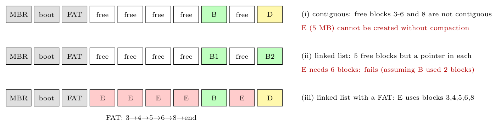

After removing **A** (blocks 3-6) and **C** (block 8), the free data blocks are **3, 4, 5, 6 and 8** (5 blocks in total); B (block 7) and D (block 9) remain. **E needs 5 MB $=5$ blocks.**

**(i) Contiguous allocation.** The free space is split into holes of 4 blocks (3-6) and 1 block (8): there is **no run of 5 contiguous blocks**, although 5 blocks are free ($\Rightarrow$ **external fragmentation**). E **cannot be created** unless the OS first **compacts** the disk (moves B and D to blocks 3-4, giving blocks 5-9 free, which costs copying 2 MB) and then puts E in 5-9.

**(ii) Linked-list allocation.** Any free block can be used, so fragmentation is no problem, but each block loses a few bytes to the next-pointer: five blocks hold slightly **less than 5 MB**, so E (5 MB) needs a **6th block**, and only 5 are free: **E cannot be created** (no space left).

**(iii) Linked list with a FAT.** The links are in the FAT, so each of the five free blocks holds a full 1 MB: **E is stored in blocks 3$\to$4$\to$5$\to$6$\to$8**, with no compaction and no wasted space; the FAT entries are updated (3$\to$4, 4$\to$5, 5$\to$6, 6$\to$8, 8$\to$end).
