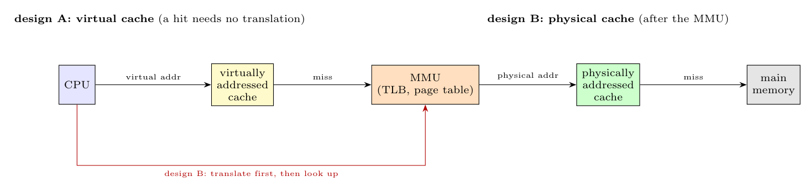

**Virtually addressed cache (design A).** The cache is indexed and tagged with *virtual* addresses and is placed **before** the MMU: a hit needs no address translation (fast). *Problems:* each process has its own virtual addresses, so the cache must be **flushed on a context switch** or tagged with a process ID; the **synonym** problem (two virtual addresses of different processes, or of the same process, that map to the same physical page can appear twice in the cache and become inconsistent); and changes of page-table entries (protection, remapping) must be reflected in the cache.

**Physically addressed cache (design B).** The cache is **after** the MMU/TLB, indexed and tagged with *physical* addresses: it needs the translation first (slower), but it is **unaffected by context switches** (no flush), has no synonym problem, works with DMA and cache-coherence protocols, and is simple to keep consistent.

**Choice with a single cache.** Use a **physically addressed** cache (in practice with the TLB lookup done in parallel with the cache index, a "virtually indexed, physically tagged" cache). Justification: it avoids flushing on every context switch, avoids aliasing and consistency problems, and keeps the OS simple; the extra translation time is hidden by the TLB and parallel lookup.
