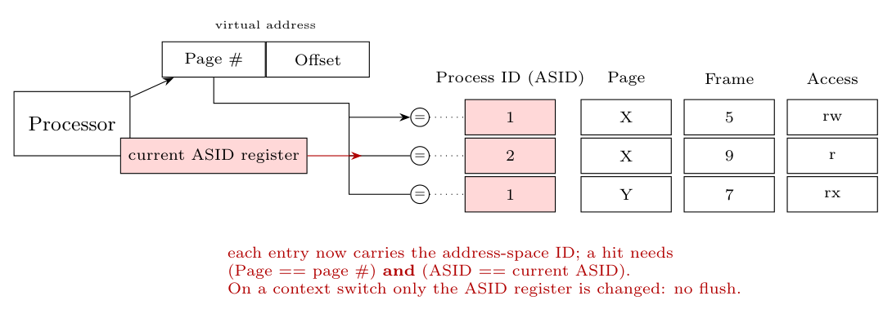

**Problem.** The TLB entries translate the *current* process's virtual pages. After a context switch, the entries of the old process must not be used for the new one (page $X$ of process 1 is a different frame than page $X$ of process 2). The simple solution is to **flush the whole TLB** on each context switch, which makes the new process start with a cold TLB.

**Update.** Add a **process (address-space) identifier, ASID/PID**, to every TLB entry and a **current-ASID register** to the hardware that the OS loads when it switches processes.

- Each entry becomes: **ASID | Page | Frame | Access**.
- The comparators now check **both** that `Page == page # of the address` **and** that `ASID == current ASID`; entries of other processes never match.
- On a **context switch** the OS only writes the new ASID into the register: **no flush** is needed, and the entries of several processes can stay in the TLB at once (they are found again when the process runs next).
- Entries of a terminated process are invalidated before its ASID is reused; shared pages are loaded once per process.
