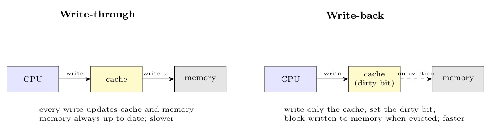

**Write-through.** Every write goes to the **cache and to main memory** at the same time (often through a write buffer). *Pros:* memory is always up to date, simple, eviction is cheap, coherence is easy. *Cons:* every write costs a memory access, so it is slower and uses more bus bandwidth.

**Write-back (copy-back).** A write updates **only the cache** and sets the block's **dirty bit**; main memory is updated **only when the dirty block is evicted** (replaced). *Pros:* repeated writes to the same block cost only one memory write, so it is much faster and uses less bandwidth. *Cons:* memory can be stale, evicting a dirty block costs a write, and coherence (other CPUs, DMA) needs more care.

On a write **miss** the policy is either *write-allocate* (bring the block into the cache first, usual with write-back) or *no-write-allocate* (write directly to memory, usual with write-through).
