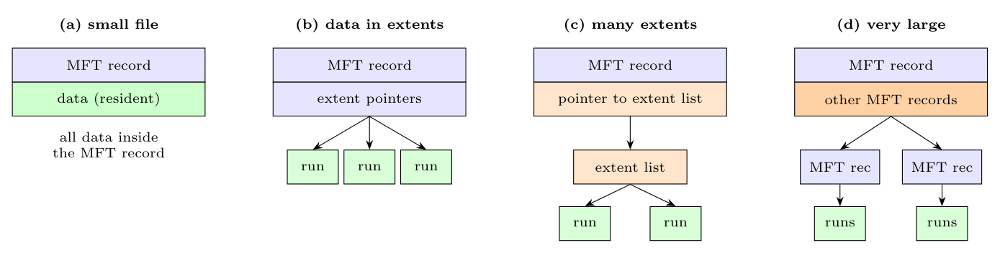

In NTFS every file is described by one or more **MFT (master file table) records** of about 1 KB, containing attributes. The way the data is located depends on the size and fragmentation of the file; the four stages are:

1. **(a) Small file:** the data attribute is **resident**: the **file's data is stored directly inside the MFT record**, so one disk access reads both metadata and data.
2. **(b) Larger file:** the data does not fit; the MFT record holds a list of **extent pointers**: (starting block, length) runs of contiguous blocks, stored outside the record. A few extents fit in the record.
3. **(c) File with many extents:** if the extent pointers do not fit in the record, the MFT record points to an **extent list stored in a separate (non-resident) block**, which holds the pointers to the data runs (like an indirect block).
4. **(d) Very large or heavily fragmented file:** the MFT record contains an **attribute list** that points to **other MFT records**, each with its own extent pointers (or lists); the number of levels grows as needed.

So NTFS uses a **variable-depth tree**: a small file needs one access, and the structure grows only as much as the file requires.
