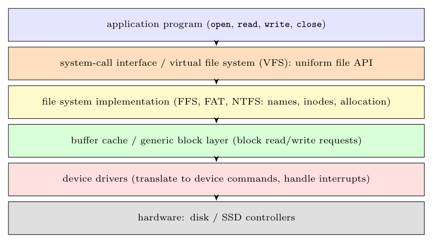

- **Application / system calls:** programs use the uniform interface `open`, `read`, `write`, `close` on named files.
- **Virtual file system (VFS) layer:** a generic interface that lets different file systems (FFS, FAT, NTFS, network file systems) be used in the same name space.
- **File system implementation:** maps file names and offsets to disk blocks (directories, inodes/MFT, allocation, free-space management).
- **Buffer cache / generic block layer:** caches disk blocks and turns file requests into requests to read or write block numbers of a device (scheduling, merging requests).
- **Device drivers:** the device-specific software.
- **Hardware:** the disk controller and the disk.

**Role of the device drivers.** A driver hides the **hardware details of one device** behind a standard interface for the OS: it **translates generic read-block/write-block requests into device-specific commands** (writing the controller's registers, setting up DMA), starts the operation, **sleeps** until the device is done, handles the **interrupt** and errors (retry, bad blocks) and returns the result. Because the details are inside the driver, the file system code is independent of the type of disk, and new devices are supported by adding a driver (often written by the hardware vendor).
