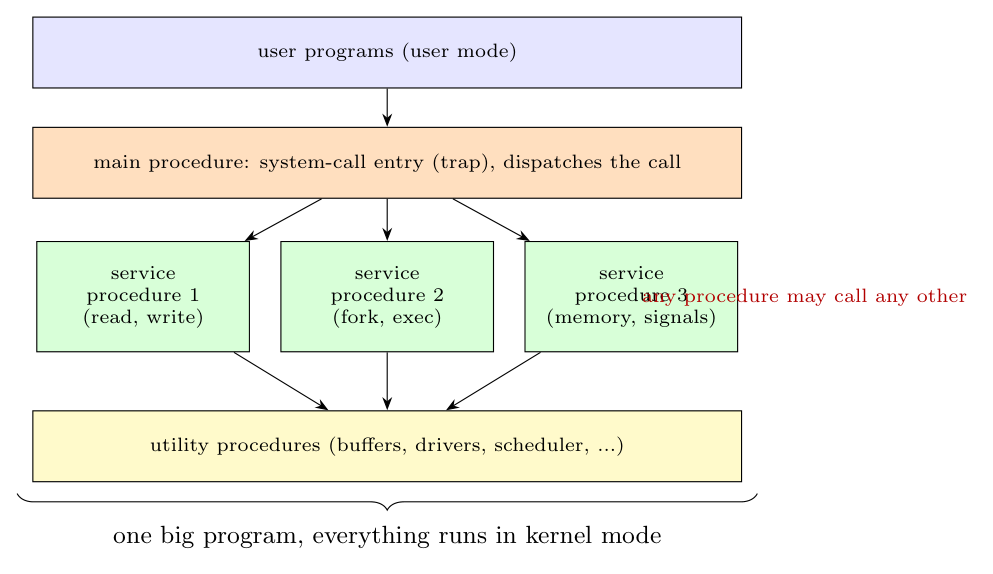

In a **monolithic system** the whole OS is one big program, linked into a single binary that runs entirely in **kernel mode**. It is organised as a collection of procedures, each of which can call any other. The only structure (see figure) is: a main procedure that is entered from a system call (trap), a set of **service procedures** that carry out the system calls, and **utility procedures** that help the service procedures.

**Main problems**

- **No information hiding or protection inside the kernel:** every procedure can call every other procedure and access all data, so the interfaces are not clean and the dependencies are tangled.
- **A bug anywhere crashes the whole system**, because all code (including device drivers) runs in kernel mode with full privileges.
- **Difficult to understand, maintain, debug and extend**; changing one part may break others.
- **Poor portability and flexibility:** adding or replacing a component (e.g. a driver or file system) requires rebuilding the whole kernel.
- The kernel grows large; there is no layered structure to verify correctness or security.

(Layered systems and microkernels were developed to cure these problems.)
