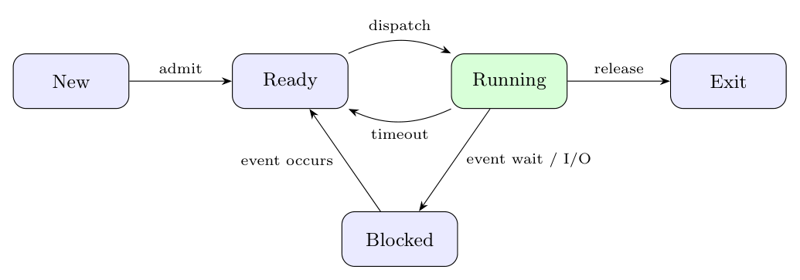

| Transition | Example |
|:--|:--|
| **New $\to$ Ready (admit)** | the user types `./a.out`; the shell forks, the OS creates the PCB and the process is admitted to the ready queue |
| **Ready $\to$ Running (dispatch)** | the scheduler picks the process because the CPU became free |
| **Running $\to$ Ready (timeout)** | the process uses up its time slice and the timer interrupt preempts it |
| **Running $\to$ Blocked (event wait)** | the process calls `read()` on the disk or the keyboard and must wait for the data |
| **Blocked $\to$ Ready (event occurs)** | the disk interrupt signals that the data has arrived, so the process can be scheduled again |
| **Running $\to$ Exit (release)** | the process calls `exit()` or finishes `main`; the OS releases its resources |
